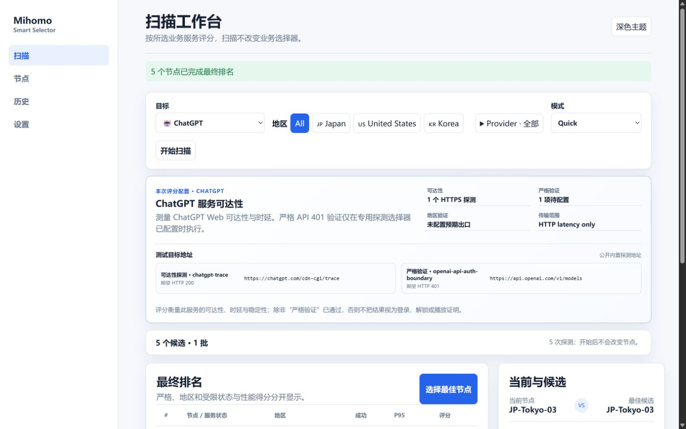
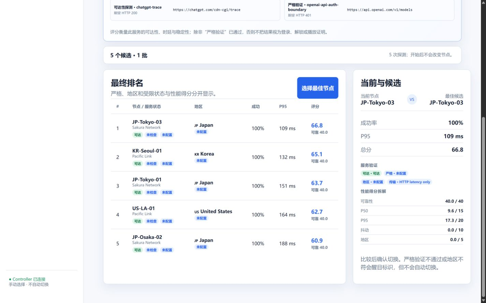

# Mihomo Smart Selector

[English](README.md) | [简体中文](README.zh-CN.md)

[](https://github.com/Uddoo/mihomo-smart-selector/actions/workflows/ci.yml)
[](LICENSE)

`Mihomo Smart Selector` is a small, self-hosted service for choosing a stable
Mihomo selector member for a particular internet service. It is designed for
OpenClash/iStoreOS, but it does not replace OpenClash and does not expose the
Mihomo controller secret to a browser.

> **Pre-release:** no stable package or public release has been published yet.
> Configuration and API compatibility may change before `v1.0.0`. The current
> dashboard UI is Simplified Chinese; English UI localization is not complete.

The current pre-release build provides:

- a Vue 3 dashboard embedded into one Go binary;
- discovery of selector groups, providers, and eligible members through the
  local Mihomo Controller API;
- configurable region classification and node overrides;
- service-aware Probe Profiles that map each selector to a no-credential,
  read-only endpoint instead of one global URL;
- multi-sample scans with median, P95, jitter, success rate, and a transparent
  90-point performance score with an independent score breakdown;
- separate reachability, strict HTTP/body verification, restriction,
  region-verification and transport-scope states, so a 200 response is never
  presented as proof of login, streaming or regional unlock;
- SQLite-backed scan and switch history;
- a deliberate, manual **Select best node** action; and
- an optional, serialized actual-egress check through an explicitly configured
  local Mihomo listener; and
- an opt-in strict-verification route that uses an isolated Mihomo selector and
  local proxy listener, never the business selector being scored.

The service binds to `127.0.0.1:8788` by default. Keep that default until an
authenticated, LAN-restricted access path has been configured.

## Screenshots

The screenshots use the repository's development-only mock Controller; node
names, timings, and Selector changes are fixtures rather than real provider
data.





## Local development

Prerequisites:

- Go 1.27.x, as declared by `go.mod`;
- Node.js 22.12 or newer; and
- pnpm 11.19.x.

A project-local Go toolchain may be placed under `.tools/go`, but that directory
is intentionally ignored and is not present in a fresh clone. The standard
commands below use the toolchains available on `PATH`.

```powershell
go mod download
pnpm --dir web install --frozen-lockfile
pnpm --dir web build
go vet ./...
go test ./...
go build -o bin/mihomo-smart-selector.exe ./cmd/mihomo-smart-selector
Copy-Item config.example.yaml config.yaml
$env:MIHOMO_SECRET = '<controller secret>'
./bin/mihomo-smart-selector.exe -config config.yaml
```

Open `http://127.0.0.1:8788` only after the local mock or Mihomo controller is
running. The server will return a clear degraded-health response while Mihomo
is unreachable.

The repository-level verification entry points are:

```powershell
./tools/verify.ps1
./tools/smoke-test.ps1
```

`verify.ps1` checks formatting, module consistency, Go tests and vet, the
frozen frontend install, TypeScript, the reproducibility of embedded web
assets, shell syntax, dependency vulnerabilities, and both Git-history and
working-tree secret scans. Use `-SkipSecurity` only for a faster local inner
loop; CI runs the complete contract with the Go race detector. The smoke test
builds both processes in a temporary directory, starts `mihomo-mock` and the
real service on ephemeral loopback ports, exercises discovery, preflight,
scan, ranking, selection, Controller state, and SQLite history, then removes
the temporary processes and files.

`scanner.probe_profile_overrides` is the safe way to configure a private
service such as Emby without replacing built-in profiles. Strict checks remain
disabled until a dedicated `__SMART_PROBE__`-style selector and loopback proxy
listener have been installed and verified. See
[the architecture and deployment design](docs/architecture.md).

## Router deployment

Deployment is intentionally a separate, verified step. Determine the target's
private LAN or Tailnet address, SSH host key, CPU architecture, Mihomo version,
available flash space, trusted client CIDR, and active OpenClash configuration
before copying files. The examples are templates, not pre-approved values for a
particular router. See the [OpenWrt/iStoreOS deployment guide](deploy/openwrt/README.md)
and [architecture and deployment design](docs/architecture.md).

The public router example requires a generated Bearer token and a trusted-CIDR
allow-list. The optional unauthenticated-LAN mode is high risk and is never the
default example. Do not add a WAN port forward.

## Security

Do not place a Controller secret, API token, provider URL, node credential,
private service address, complete proxy configuration, or built binary in
source control. Report suspected vulnerabilities according to
[the security policy](SECURITY.md), without putting sensitive evidence in a
public issue.

## Contributing

Before opening a pull request, read [CONTRIBUTING.md](CONTRIBUTING.md) and run
the complete verification and process-level smoke contracts. Public issues and
logs must be redacted according to [SECURITY.md](SECURITY.md). Project changes
are tracked in [CHANGELOG.md](CHANGELOG.md), and community participation is
covered by the [Code of Conduct](CODE_OF_CONDUCT.md).

## License

Mihomo Smart Selector is available under the [MIT License](LICENSE).
