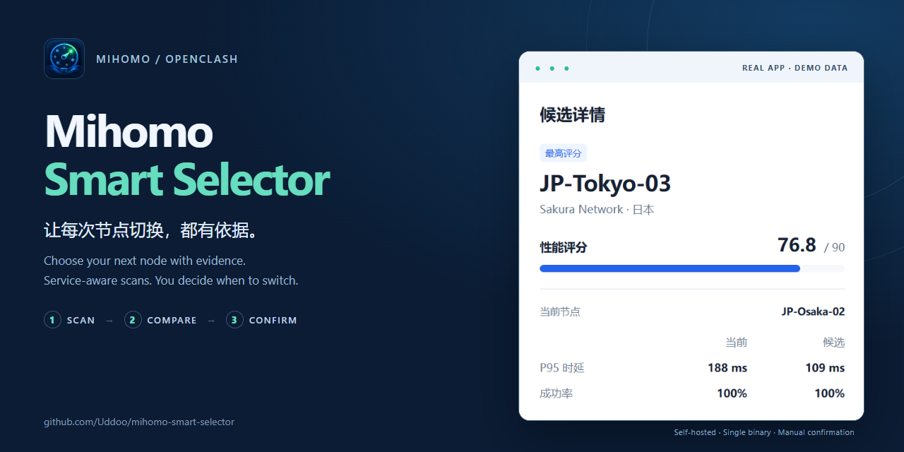
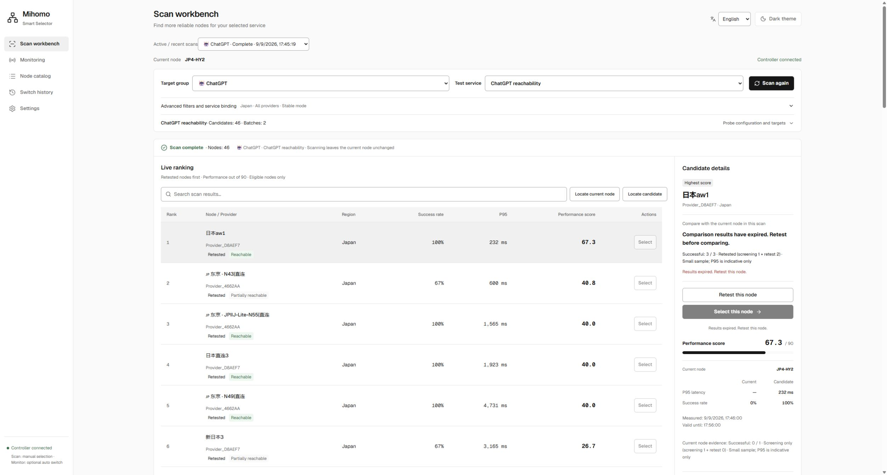
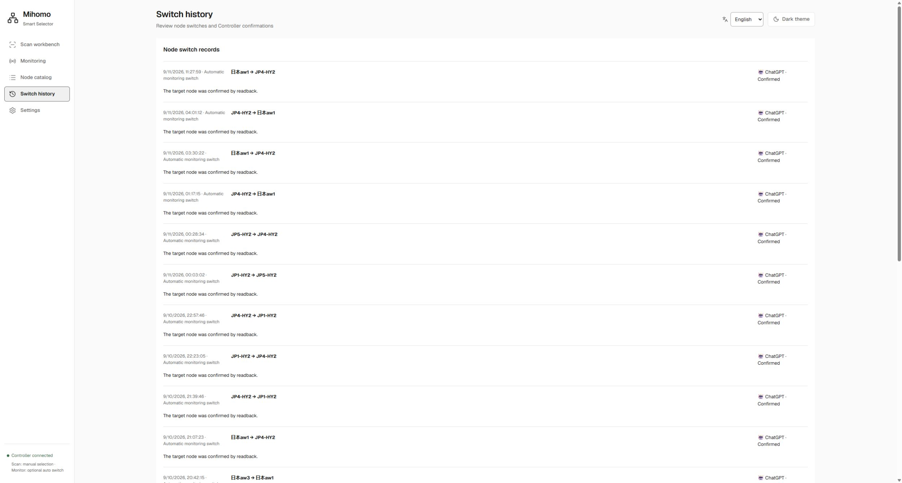
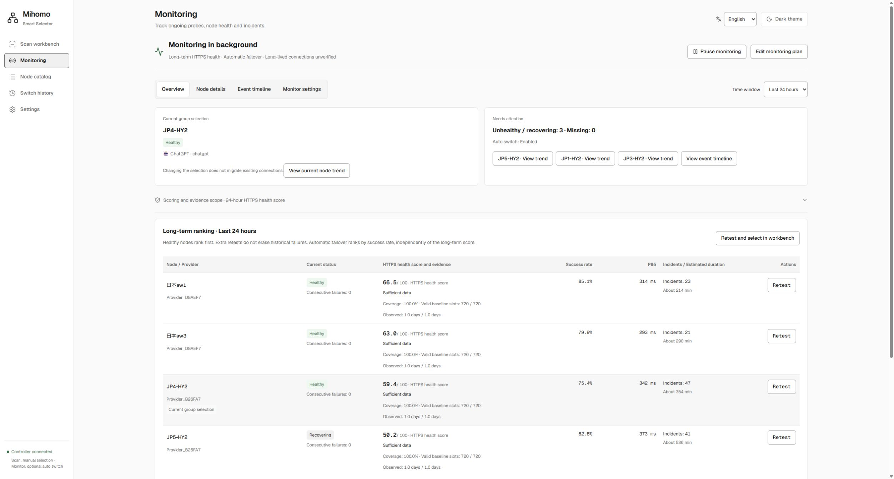
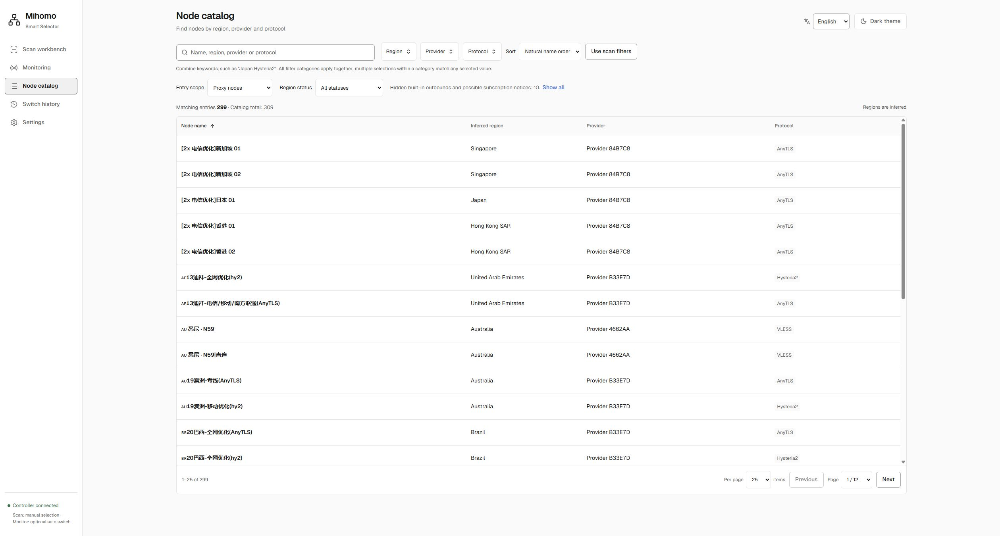
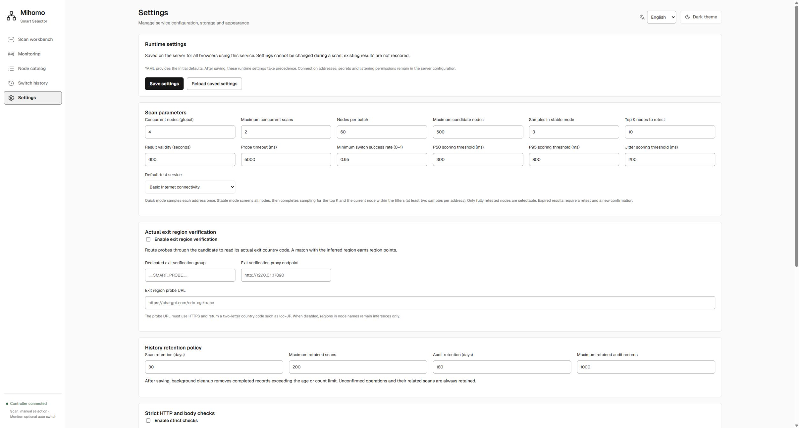

<p align="center">
  
</p>
<h1 align="center">Mihomo Smart Selector</h1>
<p align="center"><strong>Choose your next node with evidence.</strong></p>
<p align="center">Service-aware node evaluation for Mihomo and OpenClash.<br>Screen all candidates, refine the shortlist, compare with your current node — then confirm the switch.</p>
<p align="center">
  <a href="#quick-start"><strong>Quick start</strong></a> ·
  <a href="#showcase">See it in action</a> ·
  <a href="deploy/openwrt/README.md">Router deployment</a> ·
  <a href="README.zh-CN.md">简体中文</a>
</p>
<p align="center">
  <a href="https://github.com/Uddoo/mihomo-smart-selector/actions/workflows/ci.yml"></a>
  <a href="LICENSE"></a>
  <a href="#compatibility"></a>
</p>


<p align="center"><sub>Live router deployment, captured in Microsoft Edge on 2026-09-11. The selected scan was recorded on 2026-09-09; its expiry warning is preserved. <a href="docs/screenshots.md">Browse all eight views in English.</a></sub></p>
<p align="center"><strong>Single binary · Manual scan selection · Opt-in monitoring failover</strong></p>

## Why try it?

| Your question | What the workbench gives you |
| --- | --- |
| **Which node should I use for this service?** | Choose a ChatGPT, YouTube, GitHub or custom probe profile and save its group binding. |
| **Is the candidate worth a closer look?** | Screen every eligible node, then refine the top K and your current node. Inspect P95, success counts and sample evidence side by side. |
| **What happened when I switched?** | Confirm explicitly, then check the Controller readback and audit status. Unknown outcomes have a reconciliation action. |
| **How does it behave over time?** | Monitor current health and historical coverage, inspect incidents, and optionally enable failure-triggered failover. |

The service works alongside Mihomo / OpenClash. It leaves subscriptions and the
business Selector unchanged during scans; optional strict/egress checks use a
separate probe Selector. The Controller secret stays on the backend.

<a id="quick-start"></a>
## Try it locally

**Start with the included demo.** You need **Go 1.27.x** and two terminals.
The Vue dashboard is already embedded in the repository's Go build; Node.js
and pnpm are needed only when rebuilding the frontend.

In terminal 1:

```sh
git clone https://github.com/Uddoo/mihomo-smart-selector.git
cd mihomo-smart-selector
go run ./cmd/mihomo-mock
```

In terminal 2, from the same repository directory:

```sh
go run ./cmd/mihomo-smart-selector -config config.dev.example.yaml
```

Open **[localhost:8788](http://127.0.0.1:8788)**, choose **English** in the language
picker if needed, select **Stable** mode, and start a scan. The mock runs entirely on loopback, returns simulated node timings and
requires no subscription or real Controller secret. Both commands work in
PowerShell and a POSIX shell. First run downloads Go dependencies; Ctrl+C stops
each process. Ports 9090 and 8788 must be available.

### Connect your own Mihomo

**Windows portable build:** extract the matching AMD64 / ARM64 ZIP from a published
[GitHub Release](https://github.com/Uddoo/mihomo-smart-selector/releases), then run the EXE.
First launch creates configuration beside the executable. No Go or Node.js runtime is required.
See the [Windows guide](docs/windows.md#english) for availability, supported systems, configuration and upgrades.

| Where you want to run it | Next step |
| --- | --- |
| **On your computer** | Copy `config.example.yaml` to `config.yaml` and run `go run ./cmd/mihomo-smart-selector -config config.yaml`. Open **Settings → Mihomo connection**, enter the address and secret, test and save, then restart the service. YAML, `MIHOMO_SECRET` and `mihomo.secret_file` remain supported. [Graphical connection setup →](docs/connection-settings.md#english) |
| **On an OpenClash router** | Identify the CPU architecture, build the binary and install the service using the [router deployment guide →](deploy/openwrt/README.md). |

Keep the loopback listener for local use. LAN access requires a token and a
trusted-CIDR allow-list in the standard deployment configuration. Dedicated
strict/egress validation requires a separately configured probe Selector and
loopback listener. Windows packaging and a tested draft-release workflow are included;
available published versions are listed on GitHub Releases. The project remains in pre-release.

<a id="showcase"></a>
## A closer look

### 01 · Compare before switching

The current member and candidate stay visible together. Sample counts and
measurement times explain how much evidence is behind the ranking. Expired
results need a retest and a new confirmation.

In the [live workbench capture](docs/screenshots.md#scan-workbench), the candidate
panel keeps its sample evidence and expiry warning visible. Historical results
remain readable, while selection is unavailable until fresh evidence is collected.

### 02 · Check the outcome

Every switch starts with a durable pending intent. Controller readback records
a confirmed, failed or unknown outcome; retrying the same request does not
repeat the switch. Unknown outcomes remain available for reconciliation.



*These are existing records from the live deployment's enabled monitoring
failover. Capturing this page did not trigger a switch. A confirmed group selection
does not prove that existing connections migrated.*

### 03 · Observe health over time

The monitoring overview shows the current selection, nodes needing attention,
and the evidence behind the selected observation window. Open node details for
history, the event timeline for incidents, or monitoring settings for the
opt-in failover switch and diagnostics.



*Live capture, 2026-09-11. The visible rows show a full 24-hour observation span
and “Sufficient data”. A healthy current state can coexist with historical
failures; coverage and success rate measure different things. Enabled failover
is this deployment's setting, not the default.*

[All four monitoring tabs in English and how to read them →](docs/screenshots.md#monitoring-overview)

### 04 · Find nodes and inspect region evidence

Search names, regions, providers or protocols; combine region filters with
entry scope and region status. The catalog uses its own filters, with an
explicit action to copy the scan filters. Built-in aliases extend legacy
configuration, while ambiguous transit names remain available for review.



*Same live screenshot batch. The 299 / 309 counts describe this snapshot, not
a product limit. Hidden entries remain accessible through “All entries”. Regions
are inferred from names/configuration, not measured exits. Node and group names
retain the original subscription/configuration text in either interface language.*

[Region inference, entry types and manual overrides →](docs/region-classification.md)

<details>
<summary><strong>Runtime settings</strong></summary>

Scan parameters, result validity, retention and optional verification are
available in the settings page. The values shown belong to this deployment;
capturing them did not save changes.



</details>

## Ready for longer sessions

- **Resume your view:** reload the page to reconnect to an active scan; interrupted tasks remain visible after a service restart.
- **Bound the work:** scans share a global concurrency budget, with same-group duplication checks and a simultaneous-scan limit.
- **Keep history manageable:** separate scan/audit retention limits, storage-size reporting and confirmed manual cleanup.
- **Keep selection deliberate:** result expiry, optional per-service strict/region gates, durable intents and Controller readback.

These controls run in a single Go service with an embedded Vue interface and
SQLite storage. Ordinary scans keep manual selection; monitoring has an opt-in failure-triggered failover mode.

**Persistent monitoring:** enable a plan in the monitoring page to collect
low-frequency checks on the router even after closing the browser. Monitoring includes
1h/24h/7d analysis, persistent node histories, exact hourly compaction, coverage,
Provider correlation hints and redacted diagnostic bundles.
Scores require 100 valid baseline samples and stay provisional until a full scoring window
with at least 80% coverage is available for the selected scoring window. WebSocket continuity is not verified.
Optional failover replaces a confirmed-unavailable current node with the healthy
monitored candidate having the highest baseline success rate (lower P95 breaks
ties), after a fresh check. Switches have durable audits and a two-minute cooldown.
[Monitoring usage and limits →](docs/monitoring.md)
[Operation and recovery details →](docs/operations.md)

<a id="compatibility"></a>
## Verified environments & project status

| Evidence | Scope |
| --- | --- |
| **Local runtime** | Windows, using the included mock Controller and browser workflow tests. |
| **Router runtime** | NanoPi R5S LTS / ARM64 with iStoreOS 24.10.8. The 2026-09-11 Edge captures show eight views in both interface languages at deployed commit `fe393a8`. Screenshots document the displayed state, not end-to-end service or long-connection reliability. |
| **Build validation** | CI is configured to build Linux ARM64 and AMD64; use the live CI badge for the current result. Build success is not runtime validation on every device. |

The project is under active development. Configuration and API compatibility
may change before `v1.0.0`. The dashboard supports Simplified Chinese and English,
with a language picker in the page header. HTTP reachability does not prove login, playback
or regional unlock. Strict checks and egress verification are reported
separately from performance scoring.

<a id="docs"></a>
## Documentation

| I want to… | Read |
| --- | --- |
| Explore the current interface in English | [Live screenshot tour](docs/screenshots.md) |
| Run a portable Windows EXE | [Windows installation and upgrades](docs/windows.md#english) |
| Scan a service whose group contains other groups | [Nested Selector navigation and scope](docs/nested-groups.md#english) |
| Use my own group names, services or private endpoints | [Service adaptation & persistent settings](docs/service-adaptation.md) |
| Install on a router | [Deployment, preflight and rollback](deploy/openwrt/README.md) |
| Read monitoring health, trends, events and failover settings | [English screenshot tour](docs/screenshots.md#monitoring-overview) · [Detailed guide (Chinese)](docs/monitoring.md) |
| Understand inferred, ambiguous or hidden catalog entries | [Region inference and entry types](docs/region-classification.md) |
| Understand scores, isolation or the API | [Architecture & verification boundaries](docs/architecture.md) |
| Understand restart recovery, audit states or cleanup | [Long-running operation](docs/operations.md) |
| Diagnose a problem | [Troubleshooting & reporting](docs/troubleshooting.md) |
| See what changed | [Changelog](CHANGELOG.md) |

<a id="faq"></a>
## Common questions

**Will scanning switch my current business node?** No. Ordinary scans require an
explicit selection to change that group. Optional verification may temporarily
change its dedicated probe Selector, then attempts to restore it. Separately,
monitoring can switch a confirmed-unavailable current node when you explicitly
enable its failure-triggered failover mode.

**Why can a higher-scoring node appear below another?** Stable scans put refined
nodes first. Within the same stage, ranking uses score, then success rate, then
lower P95. A screening-only candidate can be retested before selection.

**Why is selection unavailable?** Check the explanation beside the action: the
scan may be incomplete, its result expired, the node removed, its success rate
below the threshold, a service gate unmet, or an earlier switch unresolved.

**Why is a service failing?** First check the Controller connection and selected
profile. For a private service, configure its actual endpoint using a profile
override. [Troubleshooting →](docs/troubleshooting.md)

<a id="development"></a>
<details>
<summary><strong>Building, testing and contributing</strong></summary>

Frontend development needs Node.js ≥22.12 and pnpm 11.19.x in addition to Go
1.27.x. A project-local Go toolchain may live in `.tools/go`; it is not included
in a fresh clone.

```sh
go mod download
pnpm --dir web install --frozen-lockfile
pnpm --dir web build
go vet ./...
go test ./...
go build -o bin/mihomo-smart-selector ./cmd/mihomo-smart-selector
```

On Windows, use `bin/mihomo-smart-selector.exe` as the build output.
Repository verification runs through PowerShell:

```powershell
./tools/verify.ps1
./tools/smoke-test.ps1
```

Verification covers formatting, modules, tests, frontend assets, workflow/shell
syntax, dependency vulnerabilities and secret checks. `-SkipSecurity` is for a
faster local loop; CI is configured to include the Go race detector. The process
smoke test uses an isolated local mock and cleans up its processes.

Please read [CONTRIBUTING.md](CONTRIBUTING.md), the [Code of Conduct](CODE_OF_CONDUCT.md)
and the [maintainer setup guide](docs/open-source-setup.md). Keep credentials,
subscription URLs and private endpoint details out of commits and public
reports. Use [SECURITY.md](SECURITY.md) for sensitive reports.

</details>

---

[MIT License](LICENSE) · [Report an issue](https://github.com/Uddoo/mihomo-smart-selector/issues/new/choose) · [简体中文](README.zh-CN.md)
