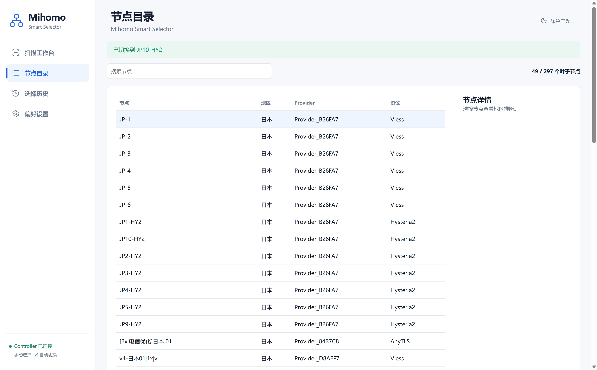
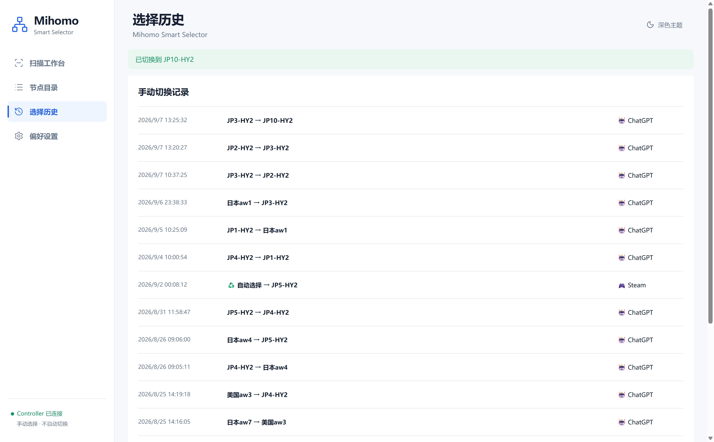
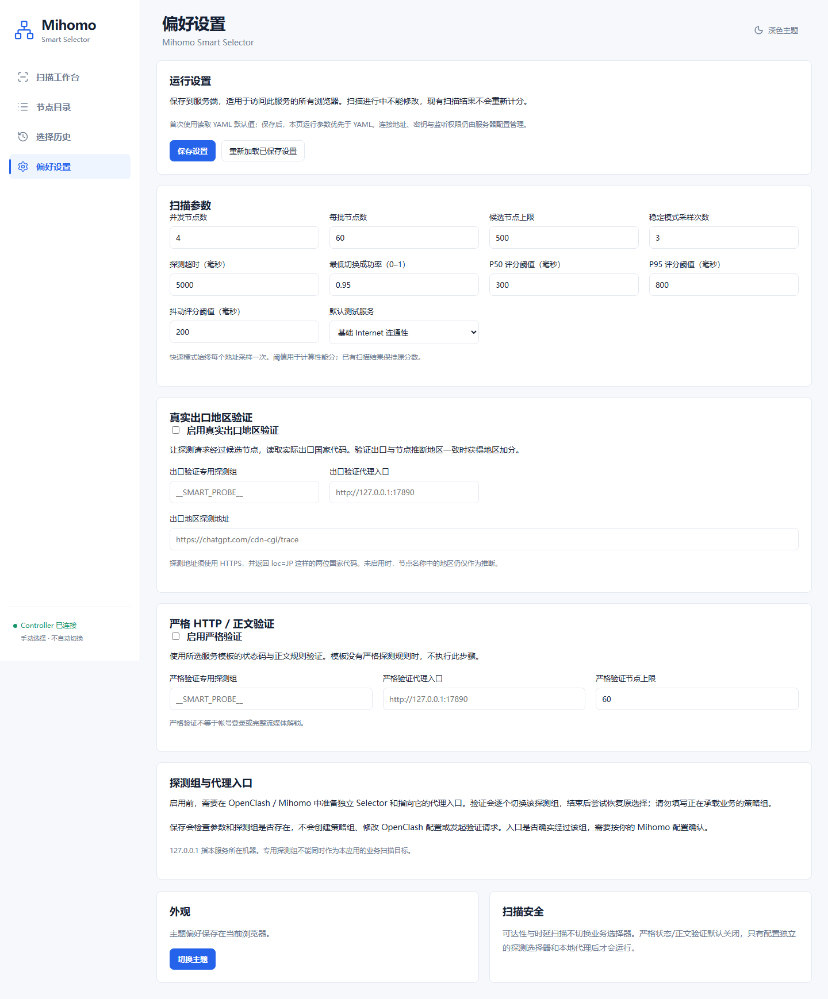
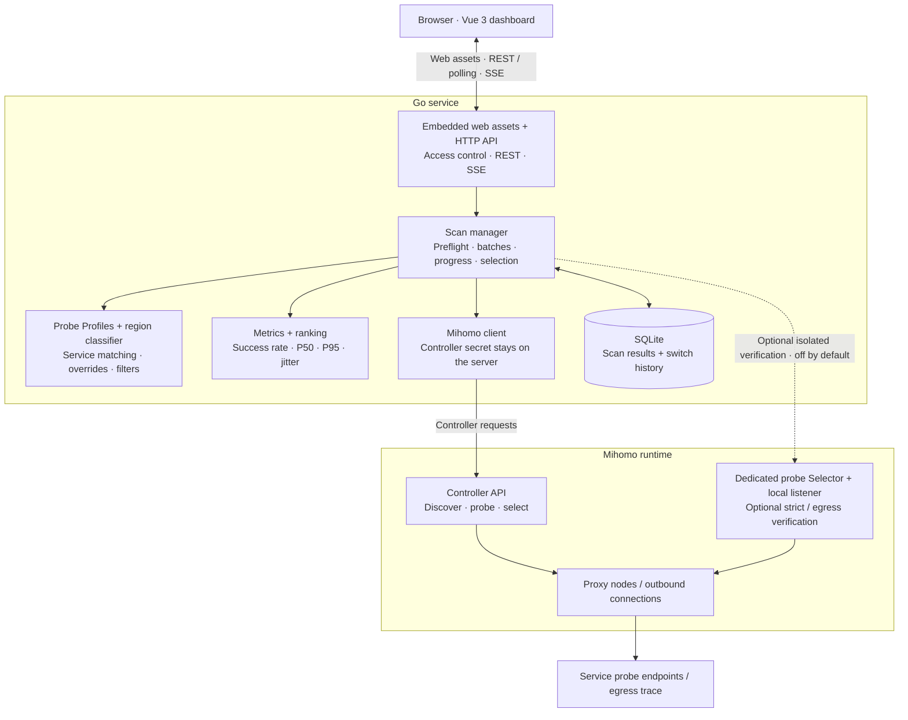
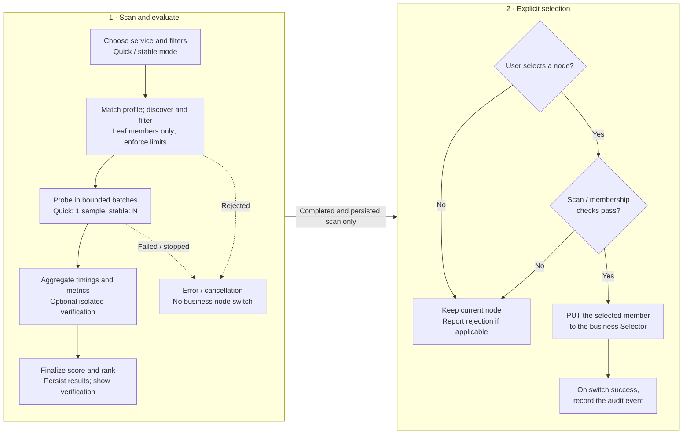

<p align="center">
  
</p>

# Mihomo Smart Selector

[English](README.md) | [简体中文](README.zh-CN.md)

[](https://github.com/Uddoo/mihomo-smart-selector/actions/workflows/ci.yml)
[](LICENSE)

`Mihomo Smart Selector` is a small, self-hosted service for choosing a stable
Mihomo selector member for a particular internet service. It is designed for
OpenClash/iStoreOS, but it does not replace OpenClash and does not expose the
Mihomo controller secret to a browser.

> **A self-hosted tool under active development, with support scoped to verified environments.**
> Runtime validation currently covers Windows with a local mock Controller and
> a NanoPi R5S LTS running iStoreOS 24.10.8 / ARM64 with Mihomo
> `alpha-smart-86ece76`. CI verifies Linux builds for ARM64 and AMD64; a passing
> build does not establish runtime support for every router or OpenClash version.
>
> **Pre-release:** no stable package or public release has been published yet.
> Configuration and API compatibility may change before `v1.0.0`. The current
> dashboard UI is Simplified Chinese; English UI localization is not complete.

The current pre-release build provides:

- a Vue 3 dashboard embedded into one Go binary;
- discovery of selector groups, providers, and eligible members through the
  local Mihomo Controller API;
- configurable region classification and node overrides;
- independently selected service profiles, persistent group bindings and
  additive custom YAML templates ([adaptation guide](docs/service-adaptation.md));
- periodic group refresh and visible stale group/profile bindings;
- multi-sample scans with median, P95, jitter, success rate, and a transparent
  90-point performance score with an independent score breakdown;
- separate reachability, strict HTTP/body verification, restriction,
  region-verification and transport-scope states, so a 200 response is never
  presented as proof of login, streaming or regional unlock;
- SQLite-backed scan and switch history;
- a deliberate, manual **Select best node** action; and
- an optional, serialized actual-egress check through an explicitly configured
  local Mihomo listener; and
- an opt-in strict-verification route that uses an isolated Mihomo selector and
  local proxy listener, never the business selector being scored.

The service binds to `127.0.0.1:8788` by default. Keep that default until an
authenticated, LAN-restricted access path has been configured.

## Screenshots

The following screenshots were captured from a real deployment and show the
scan workbench, node catalog, selection history, and preferences.

### Scan workbench


### Node catalog



### Selection history



### Preferences



The workbench image shows a preflight without starting a scan. Existing node
catalog and selection-history images retain real usage information with the
maintainer's permission.

Runtime scan parameters and verification controls can be changed in Settings.
Saved values persist on the server and override the corresponding YAML defaults
for subsequent scans. Service templates, Controller credentials and listener
access controls remain server configuration. See the
[configuration and persistence guide](docs/service-adaptation.md).

## Architecture

The Vue dashboard is served from the Go binary. The browser calls the selector
service; only the Go backend holds the Mihomo Controller secret.



Mihomo may be managed by OpenClash or run separately. The normal scan uses its
delay or provider healthcheck endpoint. Optional
strict HTTP/body and actual-egress checks use a dedicated probe Selector and
local proxy listener; they do not switch the business Selector being evaluated.
The current milestone has no background scheduler or autonomous switching.

## How it works



The performance score has a maximum of **90 points**: success rate 40, P95 20,
P50 15, jitter 10, and verified egress matching the name-inferred region 5.
Final ordering uses score, then success rate, then lower P95. Strict verification,
restrictions, and service-region checks remain separate facts, not extra score
components or proof of login, playback, or regional unlock. Live results may be
viewed while scanning; selection requires a completed, persisted scan.
Before switching, the service rechecks the scan result, minimum success rate,
and whether the node is still a member of the target Selector.

See [the architecture and deployment design](docs/architecture.md) for API
routes, configuration details, and verification boundaries.

## Quick start (5 minutes)

### 1. Build from source

```powershell
git clone https://github.com/Uddoo/mihomo-smart-selector.git
Set-Location mihomo-smart-selector
Copy-Item config.example.yaml config.yaml
$env:MIHOMO_SECRET = '<controller secret>'
go mod download
pnpm --dir web install --frozen-lockfile
go vet ./...
go test ./...
go build -o bin/mihomo-smart-selector.exe ./cmd/mihomo-smart-selector
./bin/mihomo-smart-selector.exe -config config.yaml
```

Open `http://127.0.0.1:8788` after the process starts and shows the service.

```bash
git clone https://github.com/Uddoo/mihomo-smart-selector.git
cd mihomo-smart-selector
cp config.example.yaml config.yaml
export MIHOMO_SECRET='<controller secret>'
go mod download
pnpm --dir web install --frozen-lockfile
go build -o bin/mihomo-smart-selector ./cmd/mihomo-smart-selector
./bin/mihomo-smart-selector -config config.yaml
```

### 2. Optional: OpenWrt/iStoreOS release validation

Deployment guide steps and reviewed templates are in:

- [OpenWrt/iStoreOS deployment guide](deploy/openwrt/README.md)
- [architecture and deployment design](docs/architecture.md)

At the moment, no stable published release artifacts are available.

## Configuration quick reference

Copy `config.example.yaml` to `config.yaml` and keep secrets out of the file.

Minimum fields to know:

```yaml
http:
  # Keep on loopback until you intentionally expose with token + allow-list
  listen: 127.0.0.1:8788
  api_token: "" # prefer API token in config
  api_token_env: MSS_API_TOKEN # or read token from env
  allowed_cidrs: []

mihomo:
  # Controller URL used for discovery and safe selector writes
  controller: http://127.0.0.1:9090
  # Secret is read from env only
  secret_env: MIHOMO_SECRET
  request_timeout_seconds: 8

storage:
  path: data/selector.db

scanner:
  # Tune these to your device and usage window
  concurrency: 4
  batch_size: 60
  max_total_candidates: 500
  samples: 3
  timeout_ms: 5000
  min_success_rate: 0.95
  median_target_ms: 300
  p95_target_ms: 800
  jitter_target_ms: 200
  probe_profile_overrides:
    emby.example.com:
      url: https://emby.example.com
      expected_status: "200"

egress_verification:
  enabled: false
  selector_group: __SMART_PROBE__
  proxy_url: http://127.0.0.1:17890
  trace_url: https://chatgpt.com/cdn-cgi/trace
```

- If you change `http.listen` away from loopback, set a strong `api_token`.
- If you set `http.listen` outside loopback, also set `allowed_cidrs`.
- Use `scanner.probe_profile_overrides` for private services instead of changing
  built-in public profiles.
- `probe_profile_overrides` is optional and omitted in the default file.
- Keep strict and egress verification disabled until you explicitly provision a
  dedicated selector and loopback proxy listener.

For additional tunables such as `auto_switch`, `auto_switch.*`, and strict
verification profiles, use the full [`config.example.yaml`](config.example.yaml).

## Frequently asked questions

### Why can’t the service connect to the Controller?

Check that `mihomo.controller` points to the running Mihomo Controller, that the
service can reach it, and that the secret environment variable is set (`MIHOMO_SECRET`
by default). If `mihomo.secret_file` is configured, it takes precedence: verify
the private file is readable and contains the active secret on one line.

### Why is the scan page empty?

The selector list can be empty when no Selector is eligible, the configured scope
is too strict, or required upstream probe endpoints are blocked in your network.
Review the logs, the selected Selector, and probe profile settings.

### The web page shows assets or build errors.

Re-run `pnpm --dir web install --frozen-lockfile` and `pnpm --dir web build`,
then restart the service so the embedded frontend digest is regenerated.

### What changes do I need for LAN access?

When exposing beyond loopback, set `http.api_token`, `http.allowed_cidrs`, and a
strict token policy. Prefer keeping `MIHOMO_SECRET` and Controller secrets out of
publicly shared config files.

### How do I report a security concern?

Follow [SECURITY.md](SECURITY.md), and use a private report path for any
issue that includes secrets, provider URLs, node credentials, or sensitive node
topology.

## Local development

Prerequisites:

- Go 1.27.x, as declared by `go.mod`;
- Node.js 22.12 or newer; and
- pnpm 11.19.x.

A project-local Go toolchain may be placed under `.tools/go`, but that directory
is intentionally ignored and is not present in a fresh clone. The standard
commands below use the toolchains available on `PATH`.

```powershell
go mod download
pnpm --dir web install --frozen-lockfile
pnpm --dir web build
go vet ./...
go test ./...
go build -o bin/mihomo-smart-selector.exe ./cmd/mihomo-smart-selector
Copy-Item config.example.yaml config.yaml
$env:MIHOMO_SECRET = '<controller secret>'
./bin/mihomo-smart-selector.exe -config config.yaml
```

Open `http://127.0.0.1:8788` only after the local mock or Mihomo controller is
running. The server will return a clear degraded-health response while Mihomo
is unreachable.

The repository-level verification entry points are:

```powershell
./tools/verify.ps1
./tools/smoke-test.ps1
```

`verify.ps1` checks formatting, module consistency, Go tests and vet, the
frozen frontend install, TypeScript, the reproducibility of embedded web
assets, shell syntax, dependency vulnerabilities, and both Git-history and
working-tree secret scans. Use `-SkipSecurity` only for a faster local inner
loop; CI runs the complete contract with the Go race detector. The smoke test
builds both processes in a temporary directory, starts `mihomo-mock` and the
real service on ephemeral loopback ports, exercises discovery, preflight,
scan, ranking, selection, Controller state, and SQLite history, then removes
the temporary processes and files.

`scanner.probe_profile_overrides` is the safe way to configure a private
service such as Emby without replacing built-in profiles. Strict checks remain
disabled until a dedicated `__SMART_PROBE__`-style selector and loopback proxy
listener have been installed and verified. See
[the architecture and deployment design](docs/architecture.md).

## Router deployment

Deployment is intentionally a separate, verified step. Determine the target's
private LAN or Tailnet address, SSH host key, CPU architecture, Mihomo version,
available flash space, trusted client CIDR, and active OpenClash configuration
before copying files. The examples are templates, not pre-approved values for a
particular router. See the [OpenWrt/iStoreOS deployment guide](deploy/openwrt/README.md)
and [architecture and deployment design](docs/architecture.md).

The public router example requires a generated Bearer token and a trusted-CIDR
allow-list. The optional unauthenticated-LAN mode is high risk and is never the
default example. Do not add a WAN port forward.

## Security

Do not place a Controller secret, API token, provider URL, node credential,
private service address, complete proxy configuration, or built binary in
source control. Report suspected vulnerabilities according to
[the security policy](SECURITY.md), without putting sensitive evidence in a
public issue.

## Contributing

For help or bug reports, start with the bilingual
[troubleshooting and reporting guide](docs/troubleshooting.md).
Maintainers can find the configuration mapping and hosted setup boundaries in
[open-source setup](docs/open-source-setup.md).

Before opening a pull request, read [CONTRIBUTING.md](CONTRIBUTING.md) and run
the complete verification and process-level smoke contracts. Public issues and
logs must be redacted according to [SECURITY.md](SECURITY.md). Project changes
are tracked in [CHANGELOG.md](CHANGELOG.md), and community participation is
covered by the [Code of Conduct](CODE_OF_CONDUCT.md).

## License

Mihomo Smart Selector is available under the [MIT License](LICENSE).
