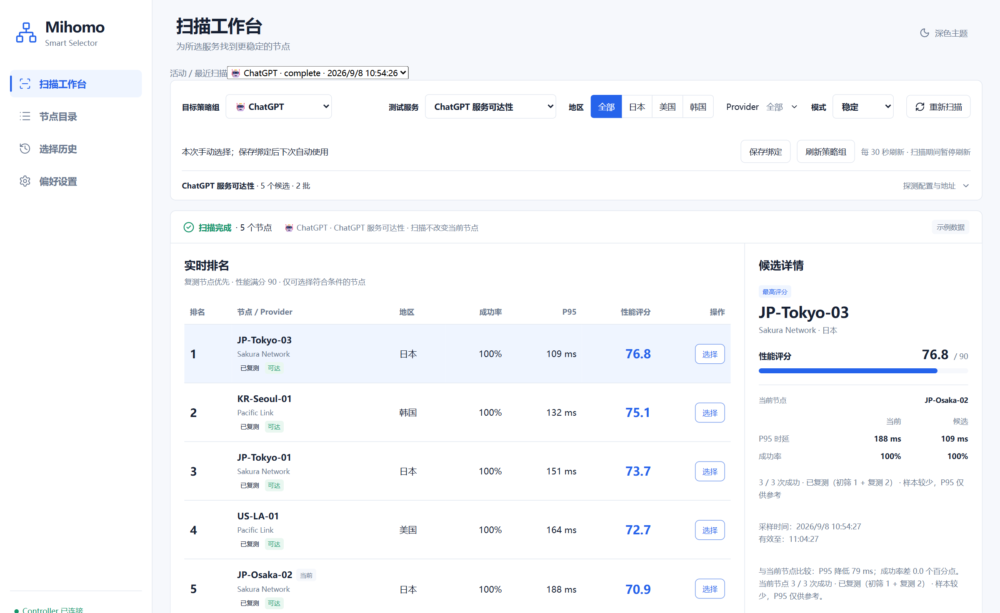
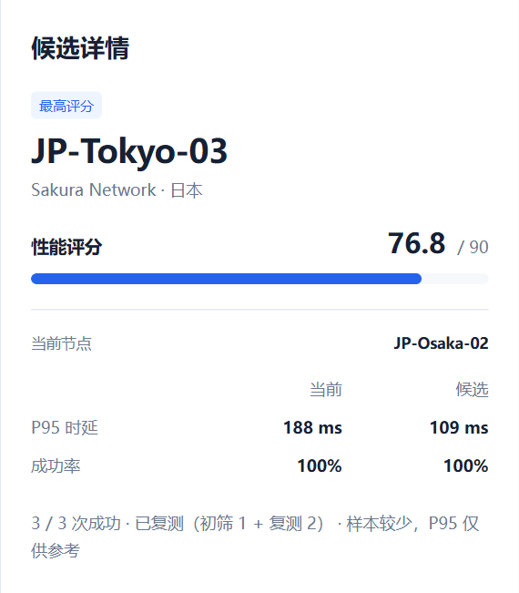
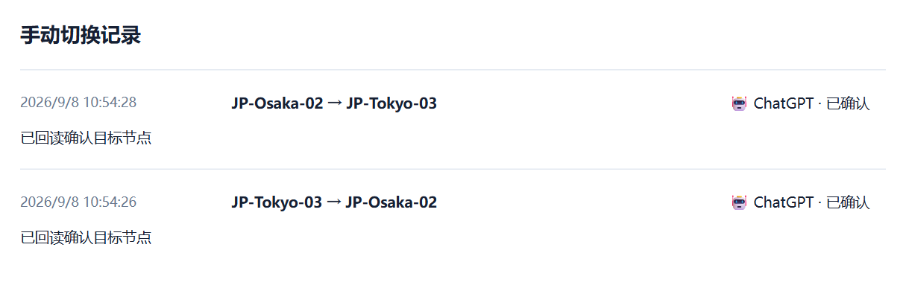

<p align="center">
  
</p>
<h1 align="center">Mihomo Smart Selector</h1>
<p align="center"><strong>按服务选节点，让每次切换都有依据。</strong></p>
<p align="center">面向 Mihomo / OpenClash 的节点评估工作台。<br>全量初筛、重点复测、对比当前节点，再由你确认切换。</p>
<p align="center">
  <a href="#quick-start"><strong>快速开始</strong></a> ·
  <a href="#showcase">看看使用效果</a> ·
  <a href="deploy/openwrt/README.md">部署到路由器</a> ·
  <a href="README.md">English</a>
</p>
<p align="center">
  <a href="https://github.com/Uddoo/mihomo-smart-selector/actions/workflows/ci.yml"></a>
  <a href="LICENSE"></a>
  <a href="#compatibility"></a>
</p>


<p align="center"><sub>真实运行界面 · 本地模拟数据。图中数值用于展示使用流程，不代表真实网络性能。</sub></p>
<p align="center"><strong>单文件部署 · 扫描手动选择 · 监控按需自动切换</strong></p>

## 它能帮你做什么？

| 你想知道的 | 工作台提供的依据 |
| --- | --- |
| **这个服务该用哪个节点？** | 选择 ChatGPT、YouTube、GitHub 或自定义探测模板，并保存策略组与服务的绑定。 |
| **这个候选值得切换吗？** | 全量初筛后，复测前 K 名与当前节点；并排查看 P95、成功次数与采样依据。 |
| **刚才的切换成功了吗？** | 手动确认后回读 Controller，展示操作与审计状态；结果未知时可以核对。 |
| **长期运行表现如何？** | 同时看当前健康与历史覆盖率，追踪事件，并按需开启故障自动切换。 |

服务与 Mihomo / OpenClash 配合运行。扫描不修改订阅，也不切换正在评估的业务策略组；
可选的严格验证与出口检查使用独立探测组。Controller 密钥始终保留在后端。

<a id="quick-start"></a>
## 先在本机体验

**可以从仓库自带的演示环境开始。** 准备 **Go 1.27.x** 和两个终端即可。
Go 构建会嵌入仓库现有的 Vue 页面资源；只有重新构建前端时才需要 Node.js 和 pnpm。

终端 1：

```sh
git clone https://github.com/Uddoo/mihomo-smart-selector.git
cd mihomo-smart-selector
go run ./cmd/mihomo-mock
```

终端 2，在同一个仓库目录运行：

```sh
go run ./cmd/mihomo-smart-selector -config config.dev.example.yaml
```

打开 **[localhost:8788](http://127.0.0.1:8788)**，选择“稳定”模式并开始扫描。
模拟 Controller 只运行在本机，返回演示节点的模拟时延，无需订阅或真实 Controller 密钥。
以上命令同时适用于 PowerShell 和 POSIX shell；首次运行会下载 Go 依赖，结束时分别按 Ctrl+C。
需要确保本机 9090 和 8788 端口未被占用。

### 接入你自己的 Mihomo

| 使用位置 | 下一步 |
| --- | --- |
| **电脑本机** | 将 `config.example.yaml` 复制为 `config.yaml`，设置 Controller 地址，通过 `MIHOMO_SECRET` 或 `mihomo.secret_file` 提供密钥，再运行 `go run ./cmd/mihomo-smart-selector -config config.yaml`。[配置说明 →](docs/service-adaptation.md) |
| **OpenClash 路由器** | 确认 CPU 架构，构建程序并安装服务，步骤见[路由部署指南 →](deploy/openwrt/README.md)。 |

本机使用保持默认 loopback 监听；标准 LAN 部署需要 token 与可信 CIDR 白名单。
严格验证、出口验证还需要事先配置独立的探测 Selector 和本机代理入口。
**当前为预发布阶段，从源码运行，尚未提供稳定版下载包。**

<a id="showcase"></a>
## 看清依据，再做选择

### 01 · 和当前节点放在一起比较

当前节点与候选节点同时可见。成功数、采样次数和测量时间帮助你判断排名有多少依据；
结果过期后，需要复测并再次确认。

<p align="center"></p>

### 02 · 切换之后，核对实际结果

每次切换都会先保存待执行记录，再回读 Controller，区分已确认、失败或未知结果。
同一次请求重试不会重复切换；未确认操作会持续保留，供你核对。



*以上三张展示图均使用仓库内置 mock 和真实应用流程，不作为帐号登录、流媒体解锁或生产网络时延的证明。*

### 03 · 持续观察健康状态与历史依据

“概览”集中显示策略组当前选择、需要关注的节点，以及所选观察窗口的证据范围。
从节点名称进入“节点详情”查看趋势，在“事件时间线”追踪变化，在“监控设置”管理自动切换与诊断。


*维护者提供的 2026-09-09 实机截图。当前“健康”与历史成功率低可以同时成立；
图中约 14 小时观测、约 46% 覆盖率，因此评分仍为暂定分，不代表已有完整 24 小时记录。
自动切换“已开启”是该部署的设置，产品默认关闭。*

[四个监控页签的截图与读图说明 →](docs/monitoring.md#live-screenshots)

### 04 · 查找节点，核对地区线索

搜索名称、地区、来源或协议，组合地区筛选、条目范围和地区状态。
目录筛选独立于扫描配置，提供明确的“沿用扫描筛选”入口。
内置地区词典会扩展旧配置，中转或名称冲突条目保留为待确认。


*同批实机截图。299 / 309 是该次运行快照的数量，不是产品容量上限。
隐藏条目仍可通过“全部条目”查看；地区来自名称或配置推断，不是出口实测结果。*

[地区推断、条目分类与手动覆盖说明 →](docs/region-classification.md)

<details>
<summary><strong>较早版本界面：偏好设置</strong></summary>

这张较早的实机截图保留作参考，可能早于当前布局。模拟图与实机图的来源区别见[截图说明](docs/assets/screenshots/README.md)。


</details>

## 也考虑到了长期使用

- **刷新后接着看：** 页面重载会恢复活动扫描，服务重启后可以查看已中断任务。
- **探测有预算：** 扫描共享全局并发，同组防重复，并限制同时运行的任务数量。
- **历史有边界：** 扫描与审计分别设置保留策略，查看存储占用，并在确认后手动清理。
- **切换有条件：** 检查结果有效期与可选服务条件，先保存操作意图，再回读确认结果。

这些能力由一个 Go 服务、内嵌 Vue 界面和 SQLite 存储提供。普通扫描保持手动选择；持续监控可显式开启故障自动切换。

**持续监控：** 在“持续监控”页面启用后，路由器会在关闭页面后继续低频探测并保存历史。
支持 1h/24h/7d 分析、小时聚合、历史序列、Provider 共同异常提示与匿名诊断包。
少于 100 个有效样本显示“积累中”，未完整覆盖所选窗口或覆盖不足时显示暂定分。长连接尚未验证。开启“故障自动切换”后，当前节点确认不可用时，
从健康的监控候选中按成功率择优，切换前复测并记录审计；默认关闭。
[持续监控使用说明 →](docs/monitoring.md)
[运行维护与恢复说明 →](docs/operations.md)

<a id="compatibility"></a>
## 已验证环境与项目状态

| 验证类型 | 范围 |
| --- | --- |
| **本地运行** | Windows，使用内置 mock Controller 和浏览器流程测试。 |
| **路由器运行** | NanoPi R5S LTS / ARM64，iStoreOS 24.10.8。2026-09-09 实机截图展示持续监控及扩展后的节点目录，不作为完整观察窗口可靠性或长连接连续性的证明。 |
| **构建验证** | CI 配置覆盖 Linux ARM64、AMD64；当前结果以顶部实时 CI 徽章为准。构建成功不等同于所有设备均已实机验证。 |

项目仍在开发中，`v1.0.0` 前配置和 API 兼容性可能变化。当前界面以简体中文为主，英文 UI 尚未完成。
HTTP 可达不等于登录、播放或地区解锁成功；严格验证和出口验证独立展示，不混同于性能评分。

<a id="docs"></a>
## 按需查阅文档

| 我想…… | 文档 |
| --- | --- |
| 使用自己的组名、服务或私有地址 | [服务适配与持久化设置](docs/service-adaptation.md) |
| 安装到路由器 | [部署、预检与回滚](deploy/openwrt/README.md) |
| 看懂监控状态、趋势、事件与自动切换 | [持续监控说明与实机截图](docs/monitoring.md) |
| 理解推断地区、待确认或隐藏条目 | [地区推断与条目分类](docs/region-classification.md) |
| 了解评分、隔离方式或 API | [架构与验证边界](docs/architecture.md) |
| 了解重启恢复、审计状态或清理规则 | [长期运行与异常恢复](docs/operations.md) |
| 排查问题或反馈 Bug | [排障与反馈指南](docs/troubleshooting.md) |
| 查看最近变化 | [更新记录](CHANGELOG.md) |

<a id="faq"></a>
## 常见问题

**扫描会切换我正在使用的业务节点吗？** 不会，普通扫描需要你明确确认选择后才会切换业务组。
可选验证会临时调整独立探测组，并在结束时尝试恢复。持续监控是独立机制：只有显式开启故障自动切换后，才会在当前节点确认不可用时自动选择候选。

**为什么分数更高的节点有时排在后面？** 稳定模式优先展示已复测节点。
同一阶段内按评分、成功率、较低 P95 排序；仅初筛的候选可以先单独复测再选择。

**为什么不能选择某个节点？** 操作旁会显示原因，例如扫描未完成、结果已过期、
节点已移出策略组、成功率不足、未满足服务条件，或之前的切换仍待核对。

**某个服务一直探测失败怎么办？** 先检查 Controller 连接和探测模板。
私有服务需要通过 Profile 覆盖规则填写实际服务地址。[排障指南 →](docs/troubleshooting.md)

<a id="development"></a>
<details>
<summary><strong>构建、测试与参与贡献</strong></summary>

前端开发除 Go 1.27.x 外，还需要 Node.js ≥22.12、pnpm 11.19.x。
项目局部 Go 工具链可以放在 `.tools/go`；该目录不包含在新 clone 中。

```sh
go mod download
pnpm --dir web install --frozen-lockfile
pnpm --dir web build
go vet ./...
go test ./...
go build -o bin/mihomo-smart-selector ./cmd/mihomo-smart-selector
```

Windows 下将构建输出路径改为 `bin/mihomo-smart-selector.exe`。
仓库验证使用 PowerShell：

```powershell
./tools/verify.ps1
./tools/smoke-test.ps1
```

验证覆盖格式、模块、测试、前端资源、工作流与 shell 语法、依赖漏洞和密钥检查。
`-SkipSecurity` 用于更快的本地迭代；CI 配置包含 Go race detector。
进程级 smoke test 使用隔离的本地 mock，并在结束后清理测试进程。

参与前请阅读 [CONTRIBUTING.md](CONTRIBUTING.md)、[行为准则](CODE_OF_CONDUCT.md)
和[维护者配置说明](docs/open-source-setup.md)。密钥、订阅地址和私有服务信息不应进入提交或公开反馈；
敏感问题按 [SECURITY.md](SECURITY.md) 的流程报告。

</details>

---

[MIT 许可证](LICENSE) · [反馈问题](https://github.com/Uddoo/mihomo-smart-selector/issues/new/choose) · [English](README.md)
