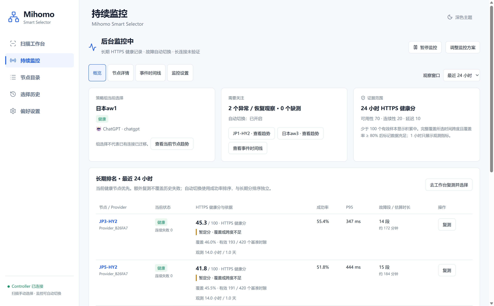
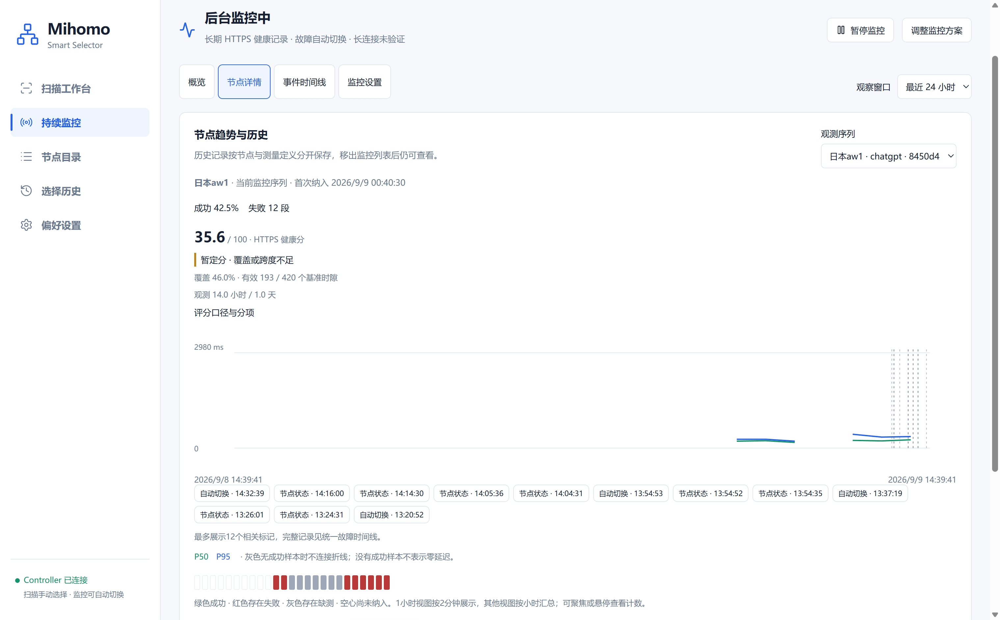
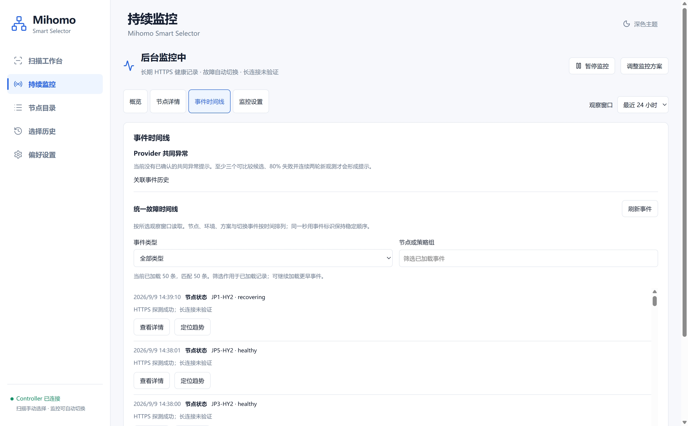
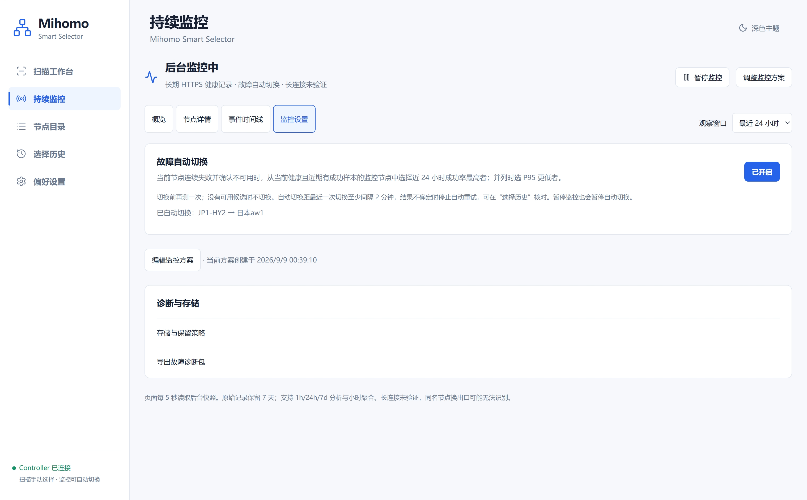

# 持续监控与长期分析（P2）

监控在 Go 服务中运行，关闭页面后继续采样。P2 增加历史连续性、1h/24h/7d分析、小时聚合、Provider相关提示、统一事件与诊断导出。HTTPS 健康分不等于 WebSocket 或真实业务完成验证。

## 使用流程

1. 在“持续监控 → 监控设置”选择业务 Selector、服务模板和候选，点击开始监控。每个 Controller 当前支持一个方案，节点数乘探测目标数最多为6。
2. 通过观察窗口选择最近1小时、24小时或7天。1小时只显示观测指标；24h/7d显示长期分和数据充分程度。
3. 在“概览”点击节点名称或异常提示进入“节点详情”，查看对应观测序列的时延、健康区间、评分依据和方案修订。也可手动选择历史序列；缺测不连接延迟线。
4. 在“事件时间线”查看 Provider 共同异常与分页事件，按类型或节点/策略组筛选已加载记录。带明确观测序列的事件可定位到包含该事件的一小时趋势，并标出事件线与对应采样时段；返回最近窗口后恢复 1h/24h/7d 分析。没有序列标识的事件只显示详情，不按同名节点推断关联；切换事件展示原节点、目标节点与状态，并提供审计入口。
5. 在“监控设置”调整方案、显式开启故障自动切换、修改保留策略或下载诊断包。监控内部切换页签会保留未保存的表单；离开整个监控页面不会自动保存草稿。暂停监控同时暂停自动切换。

概览与节点详情共用健康评分依据：1 小时仅短期观察，少于 100 个有效基准样本显示积累中，覆盖或跨度不足显示暂定分；同时展示样本数、覆盖率和观测跨度。监控页签支持左右方向键、Home 和 End 键。

## 实机界面与读图说明（2026-09-09）

以下四张图由维护者提供，来自已部署实例。截图中的节点名称、成功率、时延、事件和开关状态是当时的运行快照，不是内置演示数据、默认配置或跨网络性能基准。原图来源见[截图清单](assets/screenshots/README.md#live-20260909)。

### 概览：当前健康与长期表现分开看

- “策略组当前选择”与健康徽章反映当前选择和近期状态；点击“查看当前节点趋势”进入对应序列。
- “需要关注”中的节点可直接查看趋势。“0 个缺测”是当前状态摘要，不表示整个历史窗口没有缺测。
- 排名行同时展示当前状态、历史成功率、P95、失败段与覆盖率。截图中一行当前为健康，但历史成功率为 55.4%、健康分为 45.3；近期恢复不抹去窗口内的失败。
- 该行有 193 / 420 个有效基准时隙、46.0% 覆盖率，观测约 14 小时，而选择的是 24 小时窗口。因此超过 100 个有效样本后仍是“暂定分”：样本量、覆盖率和时间跨度需要分别看。

这里的具体分数仅用于说明如何读图，不能据此认定某个 Provider 的普遍质量，也不能把“健康”理解为业务请求或长连接已经验证。

### 节点详情：按观测序列查看趋势

右上角“观测序列”用于选择当前或历史的节点与测量定义。图中可见首次纳入时间、成功率、失败段、评分依据和覆盖率；“评分口径与分项”可展开查看。

P50 为绿色，P95 为蓝色；没有成功样本的时段不画成零延迟，也不跨缺测连接折线。健康条的绿色表示成功、红色表示存在失败、灰色表示存在缺测、空心表示尚未纳入。24 小时视图按小时汇总，小时内的详细计数可通过聚焦或悬停查看。

图中时间轴截至 `2026/9/9 14:39:41`，这是截图时点。底部最多展示 12 个相关事件按钮与标记；完整记录应进入事件时间线查看。图上的大片空白须结合首次纳入、缺测和成功样本判断，不能一律算成宕机或零延迟。

### 事件时间线：区分没有提示和没有故障

截图中“当前没有已确认的共同异常提示”，表示当前证据未形成 Provider 共同异常提示，不代表该 Provider 或所有节点没有发生过问题。提示需要满足可比较候选数量、失败比例与连续新观测轮次等条件，见下文规则。

统一故障时间线提供事件类型和节点／策略组筛选。截图显示“已加载 50 条，匹配 50 条”；筛选作用于**已加载记录**，不能把 50 条当作窗口内事件总数。需要更早记录时继续加载。

“查看详情”显示该事件的信息；“定位趋势”只在存在明确观测序列时关联趋势。`healthy`、`recovering` 等事件记录状态变化，不证明端到端业务已恢复。

### 监控设置：自动切换与诊断入口

这次部署已显式开启故障自动切换，截图显示一次 `JP1-HY2 → 日本aw1` 的切换提示。该提示记录了应用报告的组选择变化；截图不能证明既有连接迁移、用户任务完成，或展示整个切换审计链。需要在“选择历史”核对具体结果。

自动切换按近 24 小时成功率选择当前健康的候选，并以 P95 打破并列；它不按页面长期健康分排序。切换前复测、至少两分钟冷却以及未知结果停止重试仍然适用。暂停监控也会暂停自动切换。

“诊断与存储”在图中处于折叠状态，只能确认入口存在，不能据此确认具体保留参数或诊断包已经导出。页脚显示页面每 5 秒读取后台快照，以及原始记录保留 7 天；具体配置和导出边界见下文。

这组图展示了实机运行与页面状态，不替代完整 24 小时／7 天覆盖、长期资源占用、真实业务或 WebSocket 连续性验收。

## 采样与当前状态

- 候选基准周期120秒，当前节点约30秒附加检查；失败/恢复确认约10秒后执行，同类附加检查每节点每30秒最多一次。
- 后台单 worker 与手动扫描共用探测槽位，最多12次后台探测请求/分钟；预算、取消与错过执行窗口形成缺测，不积压补跑。
- Controller/组/Provider元数据约30秒核实。一次失败进入疑似异常，连续两次失败进入不可用；恢复需至少三次成功并跨两个基准时间桶。超过四分钟未观测则当前状态未知。
- 基准、当前节点检查、确认、手动复测与切换前验证分开保存。额外成功不能覆盖基准失败。
- Provider healthcheck不保证模板期望HTTP状态已经校验；P2不新增长连接测试或模型请求。

## 历史连续性与迁移

观测序列由 Controller、节点身份（名称/Provider/协议）、模板探测定义和采样规则确定，保存独立采样锚点。新增、移除、重排候选不清空未变化节点历史；相同节点与测量定义重新加入可继续旧序列，空档保留为未知。模板、Provider或协议变化创建新序列；同名同协议但供应商换出口仍可能无法识别。

方案修订不可变保存，包含成员、开关及时间，作为成员变化记录。只查看历史不会重新启用旧节点。

升级时保留当前P1方案ID、revision、成员、开始时间和自动切换偏好。旧样本按原采样锚点恢复计划时间，分批导入，水位持久化；重复启动不会重复计数。导入在启动阶段完成，小时聚合在后台回填。无法可靠关联旧方案定义的记录不会被猜测为当前模板，不进入正式排名；此类旧记录仍按7天原始保留，可显式选择匿名导出。

## 评分、覆盖率与趋势

24h/7d均使用同一版本：`S = 70A + 20C + 10L`。

- A：有效基准时隙中的成功比例。
- C：`max(0, 1 - 观测失败段数 / (有效观测小时 / 6))`。
- L：`max(0, 1 - 成功样本P95 / 1000ms)`；全失败总分为零。
- 未满100个有效样本时积累中；未完整跨过对应窗口或覆盖率低于80%时为暂定分。
- 覆盖率从窗口起点与首次纳入时间的较晚者计算，此后的暂停、移除和漏测空档不会消失。页面同时显示观测跨度，避免把几小时数据当成完整七天。
- 当前健康节点优先；历史高分不使当前不可用节点成为可用推荐。
- 故障时长按失败基准时隙估算，精度约两分钟。观测失败段与状态机确认事件不是同一计数。

小时聚合保存紧凑的每时隙结果与整数延迟，可以精确重建部分小时、P50/P95及跨小时失败段。不能平均小时P95或简单累加小时失败段。原始与聚合按时隙去重，原始记录优先；迟到样本标记该小时重算。7天原始与聚合的指标由确定性回归测试验证一致。

1小时趋势按两分钟展示，其他窗口按小时展示。未知区间不连接延迟线。图中最多展示12个相关事件标记，完整记录在统一故障时间线中分页查看。

## 故障自动切换

首次创建监控和旧版本升级不会自动打开开关，开关持久保存。

1. 当前组选择须为监控中的叶子节点，90秒内确认连续至少两次失败；Controller回读在45秒内正常。未知、缺测、疑似异常不触发。
2. 候选须为当前方案中健康、4分钟内有成功观测且有有效基准成功样本的节点。按**近24小时成功率降序、P95升序、名称**排序；不要求先有100个样本，不套用手动扫描的最低成功率门槛。
3. 受预算限制重新验证候选，失败则检查下一节点；没有候选时保持现状。模板要求严格/地区验证时暂不自动切换。
4. 与人工操作串行；切换前再次核实当前选择和成员身份。先保存意图，再PUT并回读；未知结果阻断重试，需在选择历史核对。
5. 自动切换距同组最近一次切换至少两分钟，冷却记录保存在数据库，重启不能绕过。

**切到7天视图不会改变自动切换的24小时决策窗口。** 当前节点正常时不因另一个节点分更高而切换，也不自动切回旧节点。配置切换不批量断开已有连接，不保证客户端任务已经恢复。Controller没有原子条件切换，外部客户端仍可能在回读与PUT之间改变选择，故结果核实仍是必要步骤。

## Provider共同异常与事件

同Provider至少三个可比较候选，四分钟内至少80%确认不可用，并连续两个有新观测的评估轮次满足条件，才形成共同异常提示。相同证据重复评估不算新确认。

有其他Provider同服务成功观测时，提示这一组监控候选疑似共同异常；缺少对照时明确保留共同上游或本地环境等可能性。Controller不可达、数据过期不会被断言为一批节点服务器宕机。恢复需要两轮新观测，暂停或范围变化结束观察但不称为网络恢复。

统一时间线合并节点、环境、方案、Provider、手动与自动切换事件，按UTC秒与事件标识稳定分页。相关提示不修改原始样本、不免除失败分、不强制选择某Provider。

## 存储与保留

默认原始样本7天、小时聚合及事件90天，原始记录上限100,000、小时聚合上限20,000。界面可配置范围：明细1–30天；聚合7–365天且不少于明细；事件7–365天；明细数量1000–1000000；聚合数量1000–100000。

时间或数量先到时清理最旧数据。基准明细必须已有完整且非待重算的聚合才能删除；不能为满足配额丢掉唯一证据。未聚合数据导致清理受阻时保留数据并停止采样，等待聚合后继续或提高上限。清理按小时执行，数量短期可能超限，不是瞬时硬磁盘配额。

监控、扫描、切换审计共享SQLite/WAL，切换审计仍沿用独立规则。页面报告整个DB/WAL实际大小与监控记录量，不把监控字节估算当精确文件占用。聚合空闲时每30秒检查，有积压时每5秒最多处理4个脏小时，单轮软时间预算250ms；手动扫描或重型查询运行时让出。清理移出采样循环，按小批执行；后台不运行VACUUM。待聚合数量包含当前尚未封存小时，非零并不必然是故障。

## 诊断包

默认导出最近一小时，可选不超过七天的范围。ZIP包含：

- summary.md：范围、记录数量、截断与证据边界。
- samples.csv：基准/附加检查分类、计划/完成时间、结果、延迟、原因编码和数据来源。
- incidents.json：节点、环境、方案及Provider事件。
- switches.json：人工和自动切换审计。
- manifest.json：算法/数据版本、测量定义、匿名和截断说明。

默认使用包内一致别名；真实节点、Provider、策略组和模板名称需显式选择。凭据、地址、原始错误文本、全网连接和聊天内容不导出。CSV处理公式前缀。未关联旧记录单独标为定义不足，不能参与正式排名。

最多20,000条样本、2,000条事件、8MiB未压缩内容；达到上限会明确标记截断。文件在内存生成，不上传外部服务。浏览器先以JSON/Base64取得数据，再生成下载文件，避免默认下载器提前接管后台请求。空响应不会保存成ZIP。

## API

沿用CIDR/Bearer鉴权；GET不改变配置，写操作使用revision。

| 方法与路径（前缀 /api/v1） | 功能 |
|---|---|
| GET /monitor?window=1h\|24h\|7d | 指定窗口概览、当前健康、数据版本 |
| GET /monitor/catalog?group=…&profile_id=… | 合法候选与建议集合 |
| PUT /monitor/plan | 保存方案或暂停/继续 |
| PUT /monitor/failover | 自动切换开关 |
| POST /monitor/retest | 额外复测 |
| GET /monitor/series | 当前与历史观测序列 |
| GET /monitor/revisions | 最近200个不可变方案修订 |
| GET /monitor/nodes/{series_id}/timeline | 趋势，可用window或from/to，跨度最多90天 |
| GET /monitor/incidents | 统一事件，from/to/window、cursor、limit（最多200） |
| GET /monitor/correlations | 最近100个关联事件，进行中优先 |
| GET /monitor/storage | 记录量、保留策略、DB/WAL与聚合状态 |
| PUT /monitor/retention | 修改保留策略 |
| POST /monitor/diagnostics | 导出ZIP；Accept: application/json返回Base64封装 |

后续长连接与业务验证仍属于第三阶段。P2本地功能验证不替代路由器24小时/7天的真实负载和覆盖率观察。

## 路由器资源保护

- 历史概览按数据版本共享10秒短缓存，同窗口并发请求合并；新观测、暂停或配置变更会使缓存失效。只缓存最近60条展示样本，不保留整段历史切片。
- 冷历史查询、趋势和诊断导出共用一个重型查询槽位，最多等待250ms；繁忙时暂缓历史页面，不阻塞自动切换决策。页面隐藏时停止界面轮询，服务端监控照常运行。
- 当前节点健康或状态未知时，自动切换不读取历史统计。故障成立后仍使用新鲜24小时数据，不使用页面缓存决定切换。
- 聚合与清理使用独立维护循环；空闲检查间隔30秒，有积压时小批推进，过载/截止时间到时退让。过期明细每批最多500条，数量上限清理每批最多500条，小时聚合每批最多200条，事件按类最多500条；不会一次清空大量记录。
- 自动扫描历史维护不再VACUUM，采用PASSIVE checkpoint；用户明确执行手动清理时仍可回收文件空间。
- OpenWrt部署模板使用nice=10、GOMAXPROCS=1、GOMEMLIMIT=128MiB。需要随新版本更新init才会生效。Go并行度不是CPU百分比上限，GOMEMLIMIT是Go管理内存的软预算，不是RSS硬限制。
- 上线仍需检查实际RSS、CPU增量、采样漏测率和路由延迟。本地开发机基准不能当成路由器负载保证。
