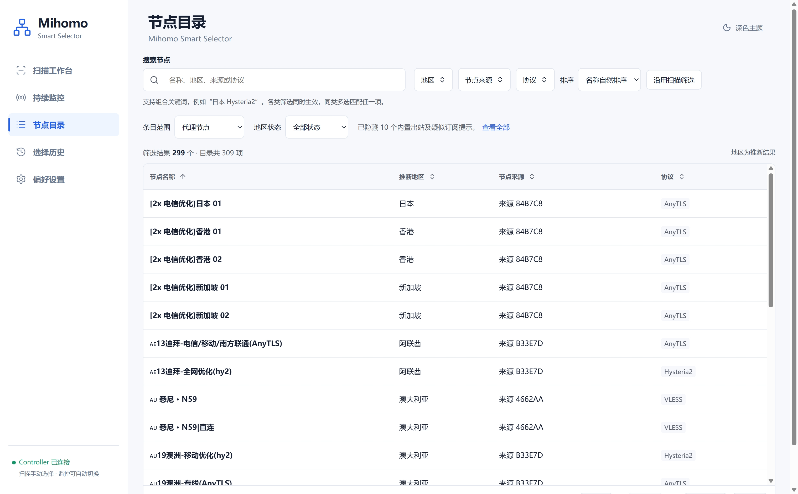

# 节点地区推断与条目分类

节点目录根据名称和配置推断地区，不访问外部定位服务，也不将名称当作已验证的出口所在地。

## 实机目录示例（2026-09-09）



这张维护者提供的实机截图显示“筛选结果 299 个 · 目录共 309 项”，并明确提示已隐藏 10 个内置出站及疑似订阅提示。
299 是当前默认范围下的结果数，不是地区识别数量；可通过“查看全部”或“条目范围 → 全部条目”恢复查看所有目录条目。

截图中香港、新加坡、迪拜／阿联酋、悉尼／澳大利亚均已显示地区，说明当前界面已呈现扩展词典的识别结果。
这些是可见条目的名称推断结果，不能从这一页推断所有 309 个条目都已实测，或保证今后所有订阅名称都能识别。

查看问题条目时，使用“地区状态 → 待确认／未知／动态地区／不适用”，再打开节点详情核对依据。
截图没有展开节点详情，因此歧义原因、手动覆盖和候选线索的行为以本说明及对应测试为依据。
这组截图的来源与版本边界见[截图清单](assets/screenshots/README.md#live-20260909)。

## 内置词典与旧配置

程序内置 40 个常见国家和地区的中文名、英文名、地区代码、旗帜及常见城市别名。
覆盖 JP、US、KR、HK、TW、SG、AE、AU、BR、CA、CL、DE、FR、GB、ID、IN、IT、MX、MY、NL、PH、RU、TH、VN、MO、CN、NZ、CH、SE、NO、FI、DK、IE、ES、PT、AT、BE、PL、TR、ZA。
只有词典中支持的旗帜才会命中；这不是完整的全球地理或城市数据库。

现有 `regions` 是扩展配置，不是识别白名单。旧 YAML 即使仅列出日本、美国、韩国，其他内置地区仍然有效：

- 同一地区按代码合并，代码去除首尾空白并转成大写。
- 自定义名称和旗帜优先，别名追加并按大小写不敏感方式去重，不删除内置别名。
- 新的自定义地区可以追加，须有代码、名称和至少一个别名。
- 同一份配置重复声明同一个地区仍然报错，防止后写配置悄悄覆盖前者。
- `region_overrides` 按完整原始节点名称匹配，优先于自动推断；可以引用内置地区，不必重复声明该地区。
- API `/api/v1/regions` 返回与分类器相同的合并后词典，供目录和扫描筛选使用。

```yaml
regions:
  - code: HK
    name: 香港
    aliases: ["自定义香江线路"]
region_overrides:
  "opaque-hk-line": HK
```

编辑启动 YAML 后需重启服务生效。地区规则不通过运行时设置页面写入，本轮也未新增地区编辑 API。

## 名称匹配和歧义

名称匹配兼容全角英数字、全角空格和零宽分隔符。英文别名保留单词边界，紧接编号的短代码仍可识别，例如 `JP4-HY2`、`HK-1`。
会回避 `sushi` 中的 `US`，以及小写普通英文单词 `in`、`it`、`no` 等误匹配。

更长且包含短名称的同一位置线索优先，例如“印度尼西亚”不会同时命中“印度”。不同位置的冲突线索不会简单按长度决定：

- `🇯🇵 香港`：地区为空，状态为“待确认”，展示日本和香港两个候选及命中线索。
- `LA香港中转01`：地区为空，状态为“待确认”，说明香港可能是中转地，而非最终出口。
- `region_overrides` 可以人工消解这些歧义。手动指定仍不等于实测验证。

名称中出现“中转”、`via` 或线路箭头等提示时，分类器保守处理；无法仅靠线路名确认出口。
只有一个明确且无中转提示的地区时才返回 `name-inferred`。没有线索时保留 `unknown`。

## 目录条目

`/api/v1/nodes` 保留所有原有非代理组条目，并增加以下字段：

| 字段 | 含义 |
| --- | --- |
| `entry_kind` | `proxy`、`builtin`、`subscription-info`、`dynamic` |
| `region_source` | 原有 `manual`、`name-inferred`、`unknown`，以及 `ambiguous`、`dynamic`、`not-applicable` |
| `region_reason` | 歧义原因：`transit` 或 `conflicting-cues` |
| `region_candidates` | 待确认地区的代码列表，顺序固定 |
| `region_evidence` | 命中的名称别名，供用户核对，不是网络探测证据 |

DIRECT、REJECT、PASS 等根据协议类型归为内置出站，不依赖节点名称。
名称以网址、到期、流量或邀请提示开头的条目仅标为“疑似订阅提示”。自动最优线路单列为动态线路，无法保证固定地区。

目录默认显示代理节点和动态线路，隐藏内置出站和疑似提示；“条目范围”可切换到全部条目或内置出站与提示。
“地区状态”可单独筛选已推断或指定、待确认、未知、动态地区和不适用。
隐藏是显示规则，不删除源节点，不修改订阅，也不移除既有监控计划。
如果真实节点被名称启发式误判为订阅提示，可以用该节点的 `region_overrides` 明确指定地区，目录将其恢复为代理节点；内置出站在目录中仍为“不适用”。

## 扫描与验收边界

扫描沿用同一地区分类器：新增识别的地区可用于显式地区筛选；冲突条目没有确定地区，不再进入某个确定地区的候选集合。
例如旧算法可能按最长别名将 `🇰🇷日本` 归为日本，新算法将其标为待确认。未指定地区的扫描流程、评分、业务切换、既有监控计划保持原有逻辑。
条目类型分类和默认隐藏只影响目录，不凭“疑似提示”名称启发式改变后台候选或监控策略。

回归测试覆盖旧配置合并、手动优先、完整/紧凑代码、普通单词误匹配、繁体/全角、旗帜、长短地名包含、冲突及中转、条目类型和目录筛选恢复。
真实节点名称可以在本地离线回放，但原始名称及订阅信息不提交到仓库。回放仅验证名称推断，不证明实际出口、服务解锁或网络稳定性。
