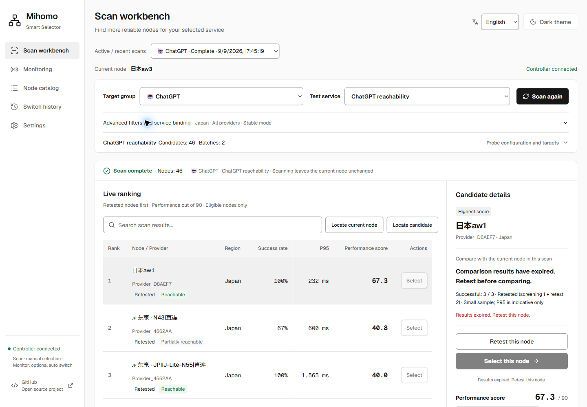
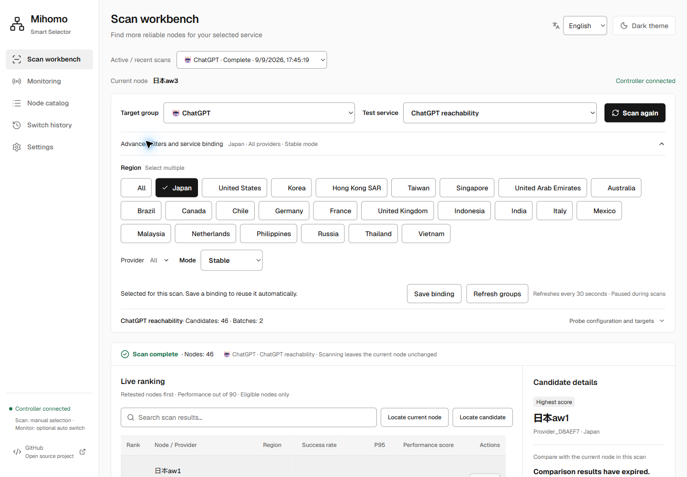
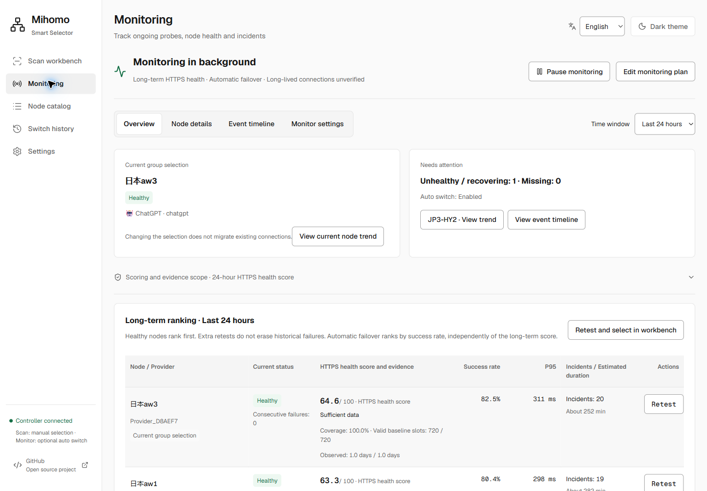
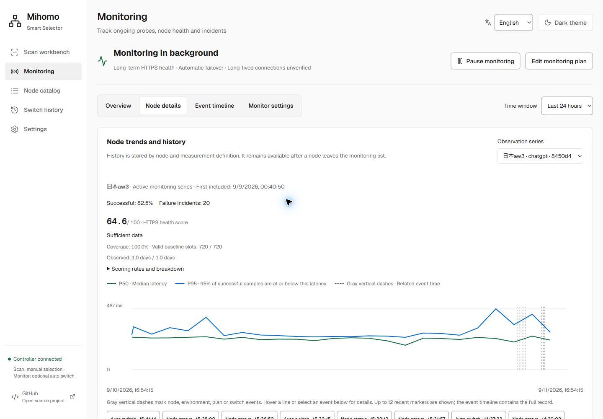
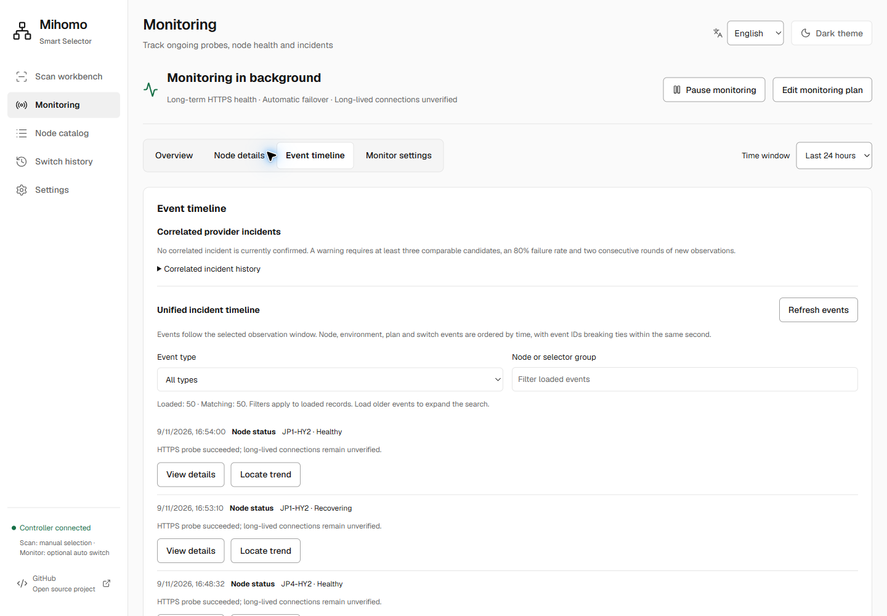
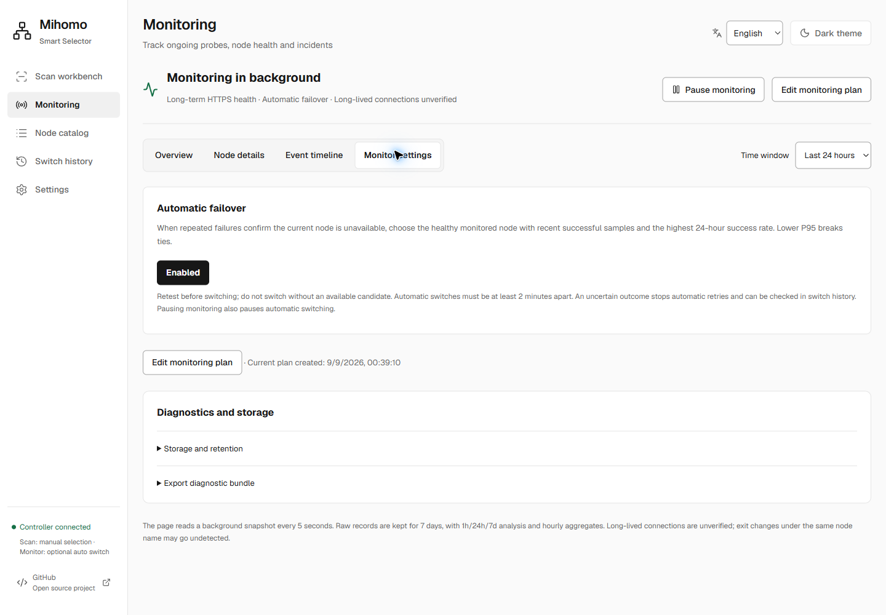
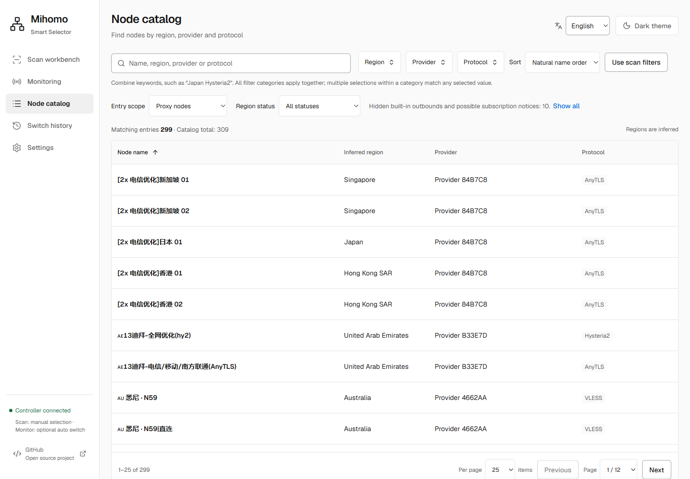
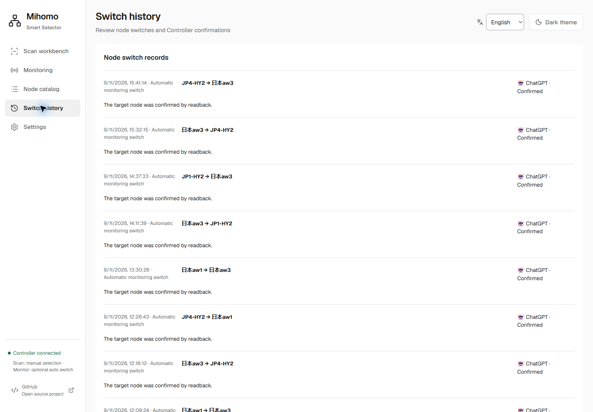
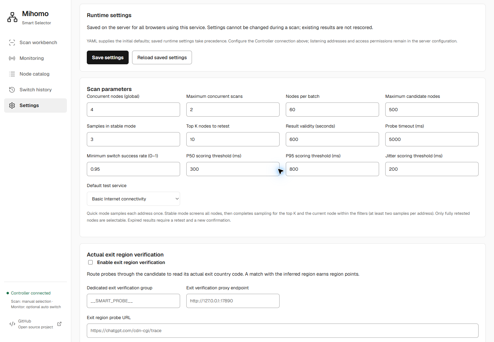

# Live interface tour

[Project overview](../README.md) · [简体中文](screenshots.zh-CN.md) · [Capture provenance](assets/screenshots/README.md#live-20260911)

These English interface screenshots were captured in Microsoft Edge on Windows
on **2026-09-11**, from the running **NanoPi R5S LTS / ARM64, iStoreOS 24.10.8**
deployment, with frontend assets matching UI commit
`b0570dcf999d5f0445df06a61e3abed2681f2396`. The preview build was deployed before
that commit was created; the [manifest](assets/screenshots/live-20260911.json) records its provenance.
They show the application using its existing router data. Each image opens at
its original resolution when clicked.

All 18 captures use the light theme, a **1440 × 1000** CSS-pixel viewport and
native PNG output at device scale 1. Text and controls remain readable without
resizing the captured images. Only navigation, scrolling, the language picker,
opening advanced filters and an existing node-trend link were used;
no scans, retests, switches or configuration saves were triggered. Background
monitoring continued, so timestamps and measurements can differ between the
English and Chinese images. Node, provider and group identifiers keep their
original text; they are not interface translations.

| View | What to look for |
| --- | --- |
| [Scan workbench](#scan-workbench) | Saved results, ranking, sample evidence and expiry |
| [Expanded scan filters](#scan-filters) | Available regions, multiple selection and control spacing |
| [Monitoring overview](#monitoring-overview) | Current health, historical score and coverage |
| [Node details](#node-details) | P50/P95 trends, observation series and event markers |
| [Event timeline](#event-timeline) | Provider hints, event filters and loaded-record scope |
| [Monitor settings](#monitor-settings) | Existing failover state and diagnostic entry points |
| [Node catalog](#node-catalog) | Search, sorting, inferred regions and pagination |
| [Switch history](#switch-history) | Existing operations and Controller confirmation |
| [Runtime settings](#runtime-settings) | Scan budgets, result validity and optional verification |

## Scan workbench

The selected stable scan was recorded on **2026-09-09** and contains 46 candidates.
The screenshot date is later than the measurement date. “Results expired” and
disabled selection controls remain visible; historical timings are not presented
as current measurements. Search stays above the table, and candidate evidence
appears beside the ranking.

## Expanded scan filters

The region list reflects regions present in the node catalog, with Japan selected
in this saved scan. Separate buttons have clear gaps, selected checkmarks and
space to wrap. The active/recent scan label is separated from its dropdown. The
sidebar footer links to the GitHub project in a new tab. Opening the panel does
not start a scan or save a binding.

## Monitoring overview

The visible rows show a full 24-hour observation span and “Sufficient data”.
Coverage measures whether baseline slots have observations; success rate
measures successful probes. A healthy node can still have historical failures
and a lower score. Automatic failover is enabled in this particular deployment;
it is opt-in, and its candidate ordering is independent of the long-term score.

## Node details

The selected series is the current node, `日本aw3`. P50 is green and P95 is blue;
gray dashed vertical lines mark related events. A red hourly block means the
hour contains failures, not that the entire hour was offline. Gaps in the line
mean no successful samples were available for that interval, not zero latency.
The scoring window, sample coverage and observation span stay visible above
the chart.

## Event timeline

“No correlated incident is currently confirmed” does not mean there were no
node failures. The displayed list has 50 loaded records, and its filters apply
to those loaded records. Load older events to extend the search. Existing event
IDs support detail and trend links; opening this page does not perform a retest.

## Monitor settings

The existing plan has automatic failover enabled. The screenshot records that
setting without changing it. Storage retention and diagnostic export sections
are collapsed, so this image documents their entry points, not an export or
particular retention values. A change in group selection does not establish
that existing connections migrated.

## Node catalog

The deployment has **309 entries**, with **299** matching the default proxy-node
scope and **10** built-in outbounds or possible subscription notices hidden.
These are snapshot counts, not capacity limits. The screenshot shows the first
page of 25 entries, with an internal scroll area. Region names are localized;
inferred regions are not verified exit locations. Natural name order follows
the selected interface locale, so the two language captures may order names
differently.

## Switch history

The visible records are previous automatic monitoring switches. “Confirmed”
reports Controller readback for the target group selection. No manual switch
was performed for these screenshots, and the records do not demonstrate account
login, streaming access or long-lived connection continuity.

## Runtime settings

The page shows the deployment's stored scan parameters and optional verification
controls. These values are not advertised as universal defaults. Connection
secrets remain in the server configuration and are not shown. The page was scrolled to Runtime settings so the connection editor remains
outside the capture. Further settings continue below the visible viewport. Nothing was
saved or cleaned up during capture.

For detailed behavior, see the [monitoring guide (Chinese)](monitoring.md) and
[region guide (Chinese)](region-classification.md). The [capture manifest](assets/screenshots/live-20260911.json)
records file dimensions, capture times and SHA-256 hashes for this batch.
