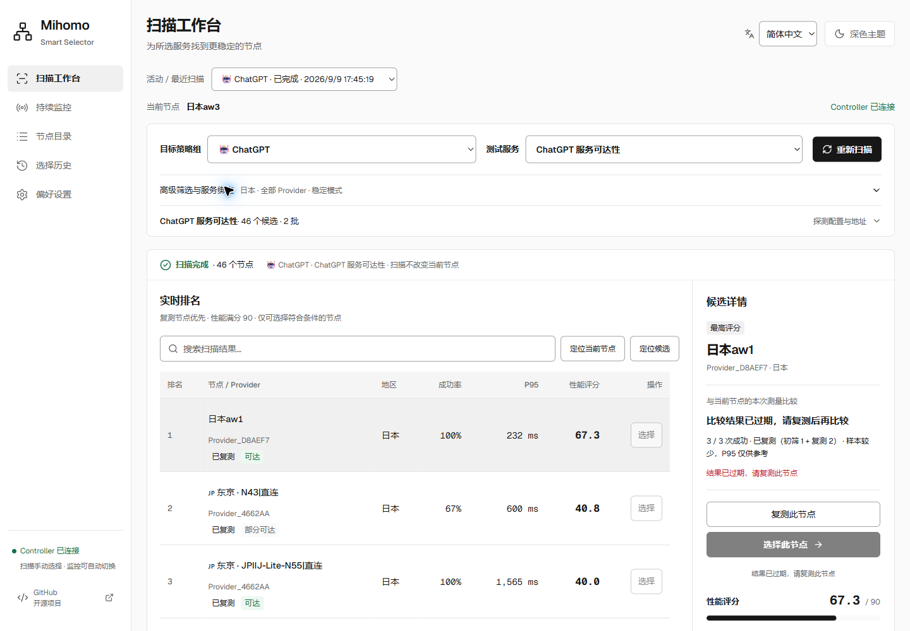
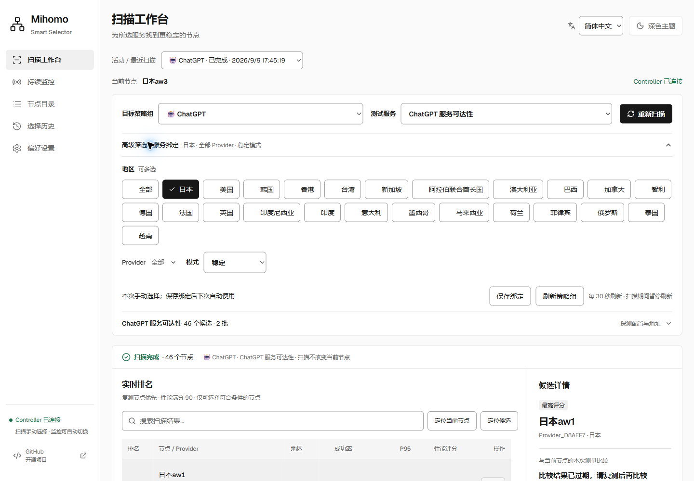
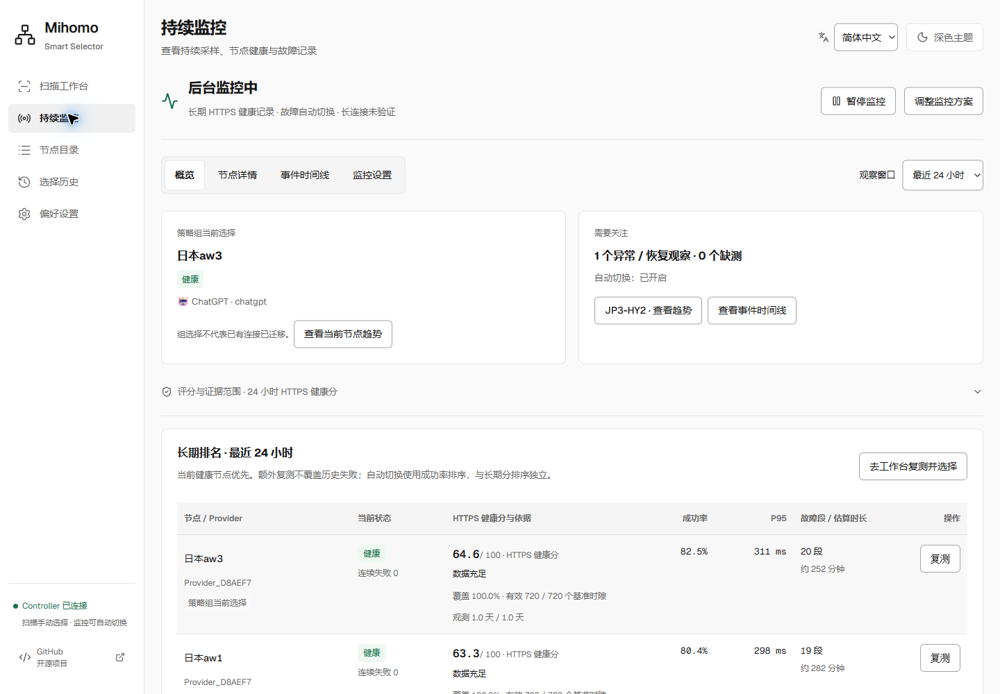
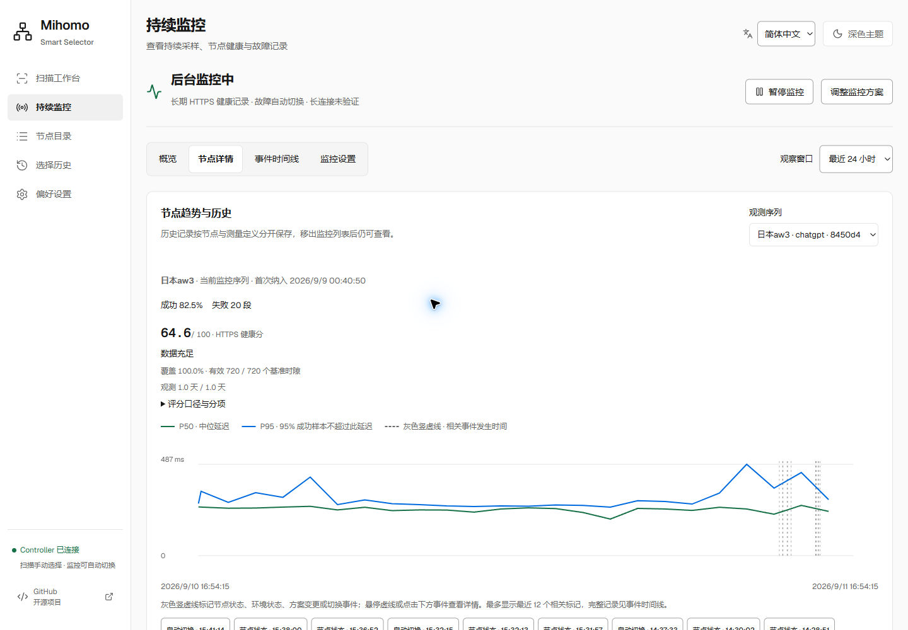
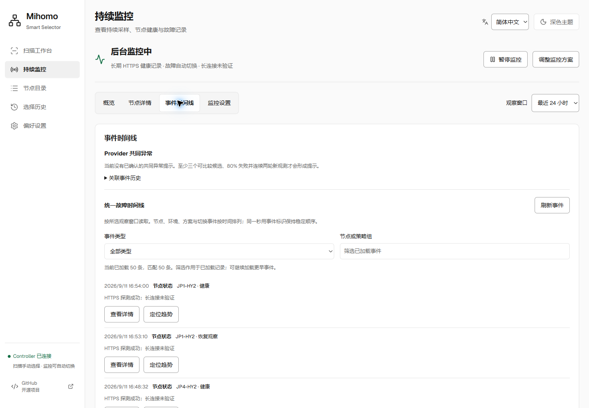
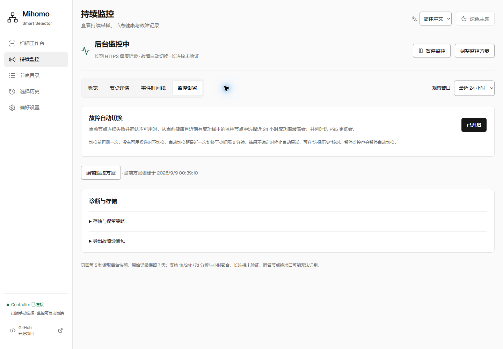
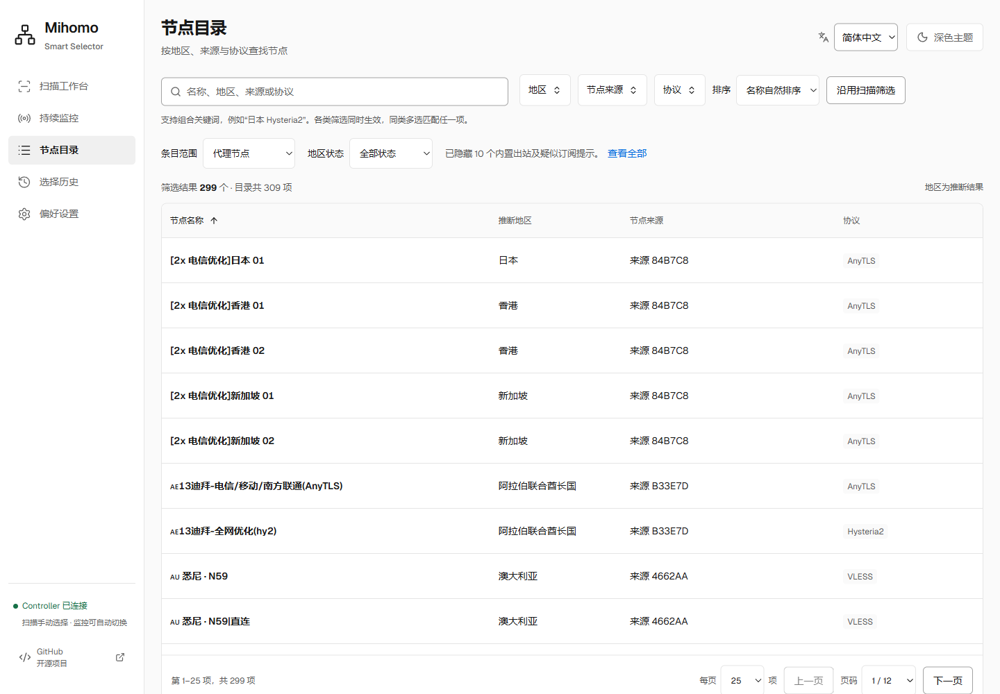
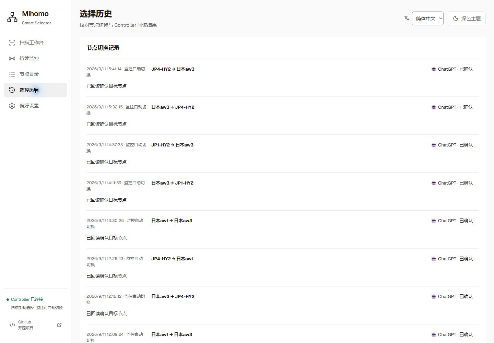
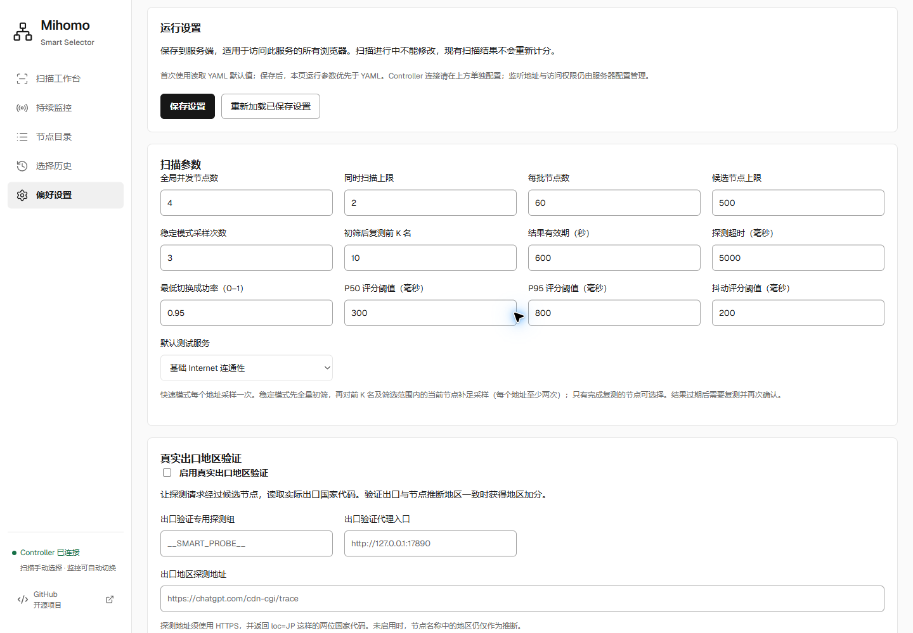

# 实机界面导览

[项目介绍](../README.zh-CN.md) · [English](screenshots.md) · [截图来源](assets/screenshots/README.md#live-20260911)

本页中文界面截图于 **2026-09-11** 使用 Windows 上的 **Microsoft Edge**，从正在运行的
**NanoPi R5S LTS / ARM64、iStoreOS 24.10.8** 路由器部署中截取，前端资源与 UI 提交
`b0570dcf999d5f0445df06a61e3abed2681f2396` 一致。截图使用先部署、后提交的预览构建，
具体来源记录在[采集清单](assets/screenshots/live-20260911.json)中。画面使用路由器上已有的数据，点击图片可查看原始分辨率。

共 18 张截图，采用明亮主题、**1440 × 1000** CSS 像素视口和设备缩放 1，保存原生 PNG，
没有事后缩放，便于在文档中看清文字与控件。操作仅包括页面导航、滚动、切换界面语言、展开高级筛选及打开已有节点趋势；
没有启动扫描、复测、切换节点或保存配置。后台监控持续运行，因此中英文图片的时间和数值可能略有不同。
节点、来源与策略组标识保留原文，不随界面语言翻译。

| 页面 | 主要内容 |
| --- | --- |
| [扫描工作台](#scan-workbench) | 历史扫描、排名、采样依据与结果过期提示 |
| [展开扫描筛选](#scan-filters) | 实际存在的地区、多选状态与控件间距 |
| [监控概览](#monitoring-overview) | 当前健康、历史评分与覆盖率 |
| [节点详情](#node-details) | P50/P95 趋势、观测序列与事件标记 |
| [事件时间线](#event-timeline) | Provider 提示、筛选与已加载记录范围 |
| [监控设置](#monitor-settings) | 当前自动切换状态及诊断入口 |
| [节点目录](#node-catalog) | 搜索、排序、地区推断与分页 |
| [选择历史](#switch-history) | 已有切换记录与 Controller 回读确认 |
| [偏好设置](#runtime-settings) | 扫描预算、结果有效期及可选验证 |

## 扫描工作台

当前查看的是 **2026-09-09** 的稳定模式扫描，共 46 个候选。截图日期晚于测量日期，界面保留“结果已过期”
和不可选择状态，历史时延不能当作当前测量。搜索位于表格上方，候选证据与排名并排呈现。

## 展开扫描筛选

地区列表只显示节点目录中实际存在的地区，图中沿用历史扫描的日本筛选。各按钮保留独立间距，
支持多选、勾选提示和自然换行。“活动 / 最近扫描”与下拉框之间留有空隙；
侧栏底部的 GitHub 入口在新标签页打开项目。展开面板没有启动扫描或保存绑定。

## 监控概览

可见排名行已覆盖完整 24 小时观测跨度并显示“数据充足”。覆盖率表示基准时隙是否有观测，成功率表示探测成功比例。
当前健康的节点仍可能有历史失败和较低评分。自动切换已在此部署中显式开启；该功能默认关闭，候选排序也独立于长期健康分。

## 节点详情

选中的是当前节点 `日本aw3` 的观测序列。绿色为 P50，蓝色为 P95，灰色竖虚线标记相关事件。
红色小时色块表示该小时包含失败，不表示整小时都离线。折线断开表示该时段没有成功样本，不表示零延迟。
评分窗口、样本覆盖率和观测跨度在图表上方同时展示。

## 事件时间线

“当前没有已确认的共同异常提示”不表示节点没有发生过故障。图中已加载 50 条记录，筛选只作用于这些已加载记录；
可继续加载更早事件扩大范围。详情与趋势入口使用已有事件标识，打开页面不会进行复测。

## 监控设置

截图记录当前方案已开启的故障自动切换，采集过程中没有修改开关。存储保留策略与诊断导出均处于折叠状态，
图中只能确认入口存在，不能证明已导出诊断包或展示具体保留参数。策略组选择变化也不等于已有连接迁移。

## 节点目录

此部署目录共 **309 项**，默认“代理节点”范围匹配 **299 项**，隐藏 **10 项**内置出站及疑似订阅提示。
数量属于截图时点，不是产品容量上限。图中为每页 25 项的第一页，表格内部可滚动。
地区名称随语言本地化，但推断地区不代表已验证的出口所在地。名称自然排序使用当前界面的语言规则，
所以中英文截图的名称顺序可能不同。

## 选择历史

可见记录来自此前的监控自动切换，“已确认”表示 Controller 回读了目标策略组的选择。
本次截图没有进行手动切换；这些记录也不证明帐号登录、流媒体访问或长连接连续性。

## 偏好设置

图中是此部署已保存的扫描参数与可选验证控件，不代表通用默认值。连接密钥保留在服务端配置中，不出现在画面中。
页面滚动至“运行设置”，连接编辑区位于截图范围之外，下方还有其他设置；采集过程中没有保存配置或清理历史。

详细规则见[持续监控说明](monitoring.md)与[地区推断说明](region-classification.md)。
[采集清单](assets/screenshots/live-20260911.json)记录本批文件的尺寸、采集时间与 SHA-256。
